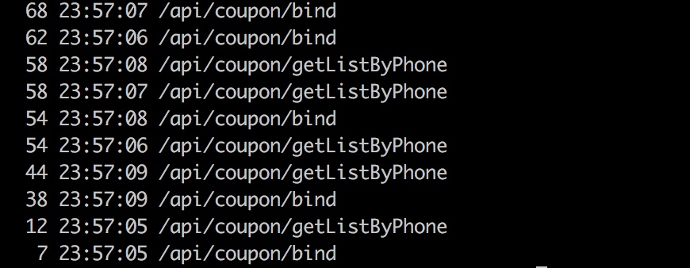

# 说明
假设日志是按日切分，其格式如下：
```
2019-01-29 20:13:11.752 [INFO] project=kotler||bltag=request_in||request_id=2019012920131167240||traceid=548763991752dnqjmHjUgC||client_ip=10.39.54.126||line=/data0/www/demo/src/Application.php +72||uri=/api/coupon/getListByBatchId||params=batch_id=676,677,678,679,680&ccc=222||msg=xxxxxxxxxxxxxxxxxx
2019-01-29 20:13:12.052 [INFO] project=kotler||bltag=request_out||request_id=2019012920131167240||traceid=548763991752dnqjmHjUgC||client_ip=10.39.54.126||line=/data0/www/demo/src/Application.php +79||uri=/api/coupon/getListByBatchId||params=batch_id=676,677,678,679,680&ccc=222||response={"errno":0,"error":"","request_id":"2019012920131167240","data":{"result":1}}||latency=300.00ms||msg=yyyyyyyyyyyyyyyyyy
```

针对这些日志，要从中统计出API的QPS和Latency

# 统计
## 统计最近时间段单机top10的QPS
```
cd /path/to/log_dir
tail -10000 demo.log | grep request_in | awk -F'.' '{print $1}' | sort | uniq -c | sort -nr | head -10
```


## 统计最近时间段内单机API的QPS分布
```
cd /path/to/log_dir
tail -10000 demo.log | grep request_in | awk -F'\\|\\|' '{print $1,$7}' | awk -F'.' '{print $1,$2}' | awk -F' ' '{print $1,$2,$6}' | sed 's/uri=//g' | sort | uniq -c | sort -nr
```


## 统计最近时间段内单机QPS最大的API
```
cd /path/to/log_dir
tail -10000 demo.log | grep request_in | awk -F'\\|\\|' '{print $1,$7}' | awk -F'.' '{print $1,$2}' | awk -F' ' '{print $6}' | sed 's/uri=//g' | sort | uniq -c | sort -nr | head
```


## 最近时间段内访问量最大的上游机器
```
cd /path/to/log_dir
tail -10000 demo.log | grep request_in | awk -F'\\|\\|' '{print $1,$5}' | awk -F'client_ip=' '{print $2}' | sort | uniq -c | sort -nr | head
```


## 最近时间段内各个状态码分布
```
cd /path/to/log_dir
tail -10000 demo.log | grep request_out | awk -F'\\|\\|' '{print $9}'|awk -F',' '{print $1}' | sed 's/response={//g' | sort | uniq -c | sort -nr
```


## 最近时间段内耗时top10的API
```
cd /path/to/log_dir
tail -10000 demo.log | grep request_out | awk -F'\\|\\|' '{print $10,$7}' | sed 's/latency=//g' | sed 's/ms / /g' | uniq | sort -nr | head
```


## 统计所有API的平均耗时
```
cd /path/to/log_dir
tail -10000 demo.log | grep request_out | awk -F'\\|\\|' '{print $10}' | sed 's/latency=//g' | awk -F'ms' '{sum+=$1} END {print  "avg =",sum/NR}'
```


## 统计单个API的平均耗时
```
cd /path/to/log_dir
tail -10000 demo.log | grep request_out | awk -F'\\|\\|' '{print $10,$7}' | sed 's/latency=//g' | sed 's/ms / /g' | uniq | sort -nr | head
```
