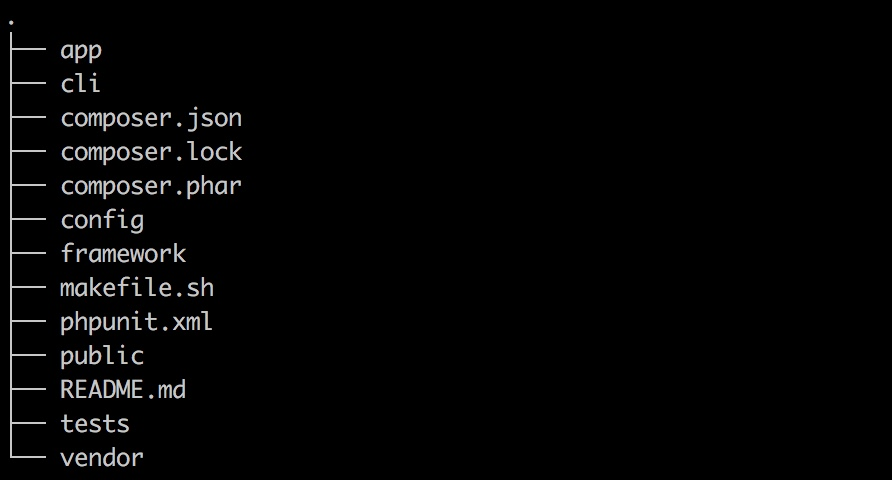
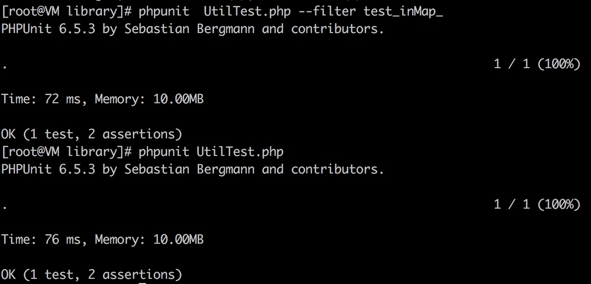
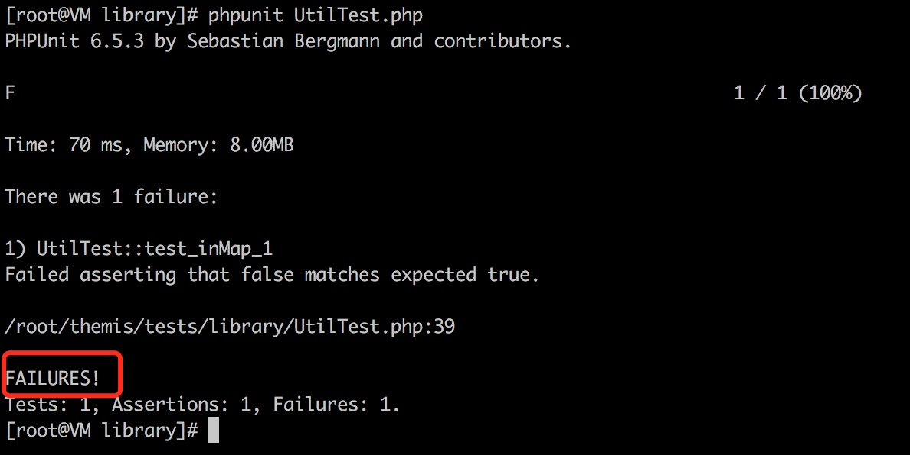
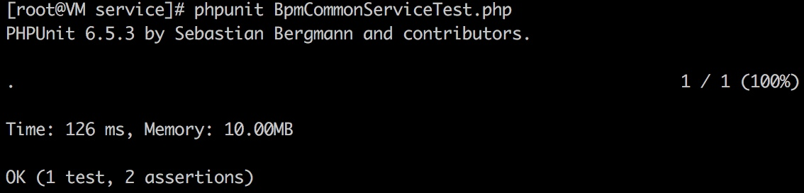
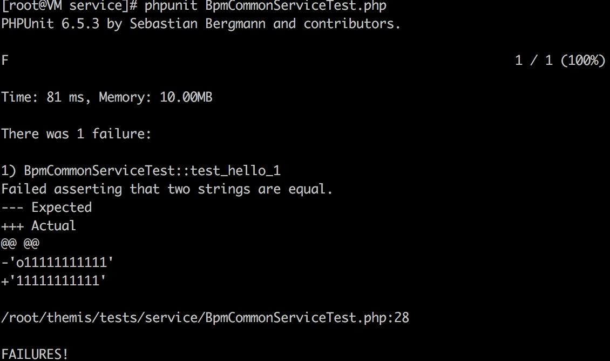

# Phalcon 单测实践
## 概述
本文重点讲解如何在`Phalcon`框架中做好单测。

## 名词解释
### 单元测试
如果你听说过`测试驱动开发(TDD:Test-Driven Development)`，单元测试就不陌生。  

单元测试 (Unit Testing)，简称单测，是指对软件中的最小可测试单元进行检查和验证。
> 最小可测试单元，可能是一个模块、一个函数或者一个类

### Phalcon
PHP开源MVC框架，具体请参看 [官方文档](http://www.myleftstudio.com)

### PHPUnit
官方语：`PHPUnit`是一个面向PHP工程师的测试框架，这是一个xUnit的体系结构的单元测试框架。具体请参看 [官方文档](http://www.phpunit.cn)，或参看 [源码](https://github.com/sebastianbergmann/phpunit)

### mockery
PHP 单测框架，具体可参看 [官方文档](http://docs.mockery.io) 或 [源码](https://github.com/mockery/mockery)

## 为什么要有单测
单测不同于其他测试手段，它属于研发工程师编码的一部分。
> 有的团队甚至把单测覆盖率作为提测的准入条件之一

**单测可以让研发工程师思考得更全面，保证代码的运行质量。**

- 是一种验证行为，可以确保工程师的代码是符合预期的，并且通过单测量化了验证行为
- 是一种编写文档的行为，别人想了解你的代码为什么这么写，那么写为什么不可以，都可以通过单测找到一些答案

**对于单测，难免有些不同的声音出现，比如影响开发效率，短期看这种观点好像没问题，但长期看无异于喝了一杯毒药**

> 前同事：你现在很口渴，我给你一杯毒药你喝吗？

## 怎么写单测
### 准备工作
1. 已经有了一个`Phalcon`的项目，目前结构类似

2. 项目是`composer`管理的
3. 安装`PHPUnit`参看 [文档](http://www.phpunit.cn/getting-started.html)
4. 引入`mockery`，在`composer.json`文件中的`"require-dev"`配置中加入`"mockery/mockery": "@stable"`，保存后运行`composer update mockery`
5. 将`public/index.php`复制到`tests`目录下，把`\Framework\ErrorHandler::init();`这行代码后的其他删除

### 开始写单测
假如在项目中有个Util类，现在有针对该类中的一个方法写单测。  

#### 示例1

_Util.php_
```php

class Util
{
    public static function inMap($k, $aliasMap)
    {
        return isset($aliasMap[$k]) ? true : false;
    }
}
```

_UtilTest.php_

```php

include_once dirname(__FILE__) . '/../index.php';

class UtilTest extends Mockery\Adapter\Phpunit\MockeryTestCase
{
    public function tearDown() {
        Mockery::close();
    }

    /**
     * phpunit --bootstrap ../../vendor/autoload.php UtilTest.php --filter test_inMap_1
     */
    public function test_inMap_1()
    {
        $cases = [];
        $c = [];
        $c['expect'] = true;
        $c['case'] = ['k' => 'k0', 'arr' => ['k0' => 0]];
        $cases[] = $c;

        $c = [];
        $c['expect'] = false;
        $c['case'] = ['k' => 'k00', 'arr' => ['k0' => 0]];
        $cases[] = $c;

        foreach ($cases as $i) {
            $this->assertEquals($i['expect'], NewHouse\library\Util::inMap($i['case']['k'], $i['case']['arr']));
        }
    }
}
```

_运行结果_  
进入测试类`UtilTest.php`所在的目录，运行以下的其中一条命令  

```php
phpunit UtilTest.php
phpunit --bootstrap ../../vendor/autoload.php UtilTest.php --filter test_inMap_1
```
单测成功如下图  


单测失败如下图  


#### 示例2
_ThemisBpmTaskData.php_
```php
class ThemisBpmTaskData
{
    private $dao;
    private $logger;

    public function __construct()
    {
        $this->dao    = new ThemisBpmTaskDao();
        $this->logger = Context::getService('logger');
    }

    /**
     * 获取一条数据
     *
     * @param $where
     *
     * @return array
     */
    public function queryOneTask($where)
    {
        $now            = microtime(true);
        $where['valid'] = 0;
        $conds          = $this->dao->prepareWhere($where);
        $optString      = $this->dao->prepareOption(['limit' => 'limit 1']);
        $result         = $this->dao->select([], $conds['where'], $conds['bind'], '');
        $latency        = intval((microtime(true) - $now) * 1000) . 'ms';
        $this->logger->info(["queryOneTask res" => $result, "latency={$latency}"]);

        return isset($result[0]) ? $result[0] : [];
    }
}
```
_BpmCommonService.php_

```php

class BpmCommonService
{
    public static function hello()
    {
        $o = new ThemisBpmTaskData();
        $r = $o->queryOneTask(['where' => 1]);
        if ($r) {
            return '11111111111';
        }
        return '-11111111111';
    }
}

```
_BpmCommonServiceTest.php_
```php
class BpmCommonServiceTest extends MockeryTestCase
{
    public function tearDown() {
        Mockery::close();
    }

    /**
     * phpunit BpmCommonServiceTest.php
     */
    public function test_hello_1()
    {
        $mock = Mockery::mock(ThemisBpmTaskData::class)->makePartial();
        $mock->shouldReceive('queryOneTask')->andReturn(true);

        $o = new \NewHouse\service\bpmproxy\BpmCommonService();
        $this->assertEquals('11111111111', $o->hello());
    }
}
```
_运行结果_  
进入测试类所在的目录，运行命令  

```php
phpunit BpmCommonServiceTest.php
```
单测成功如下图  


单测失败如下图  
