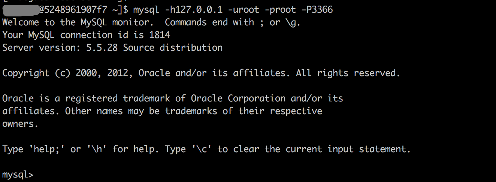
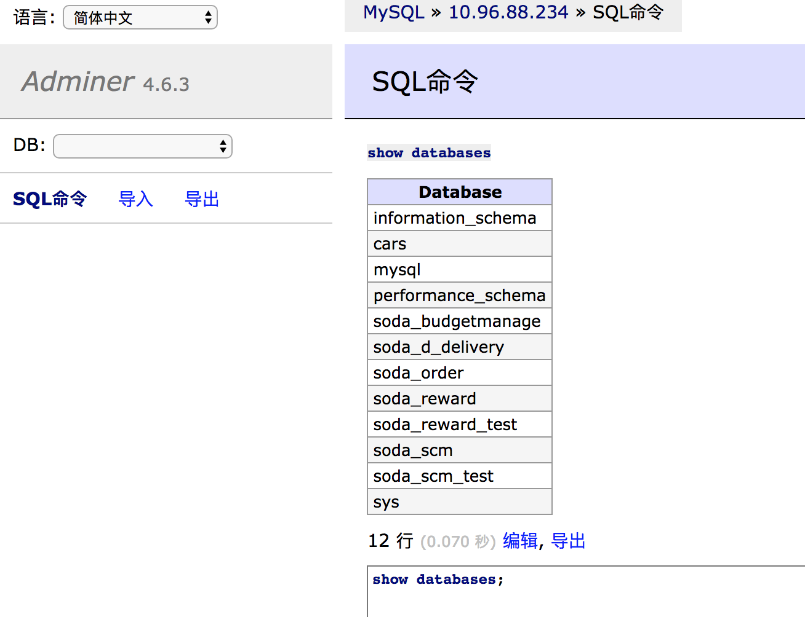

# 概述
`MySQL`是我在开发过程中使用最频繁的数据库，如何能快速登录并使用`MySQL`直接影响了我的开发效率。

# 工具介绍
我个人在使用`MySQL`时，一般用到以下方式。

## Terminal 直连
如下图


## adminer
如下图

我想要的功能都支持，是我最喜欢的方式啦！当然，前提是我是PHPer。

### 安装
- 下载，请移步 https://www.adminer.org/#download，
- 安装很简单，随便创建一个目录，把源文件(只有一个文件)放到目录下即可
>> 我把文件重命名成 `mysql.php`
- 配置nginx，并重启
```
server {
	listen 8004;
	root /home/webroot/mysql/;
	index index.php index.html index.htm;
	location /adminer {
		rewrite ^/(.*)$ /index.php/$1 break;
		fastcgi_index index.php;
		fastcgi_param SCRIPT_FILENAME $document_root$fastcgi_script_name;
		fastcgi_pass 127.0.0.1:9001;
		include fastcgi.conf;
		client_max_body_size 20m;
	}
}
```
- 访问
在浏览器输入 `http://localhost:8004/adminer/mysql.php`，输入相应信息后即可登录并开始使用

### 排错
如果在`SQL命令`点击`执行`时出现`无效 CSRF 令牌。重新发送表单……`。

请找到`php.ini`中的`session.save_path = "/path/to/dir/"`，确认该目录存在且有写权限。

## 其他
比如 phpMyAdmin、navicat 等，要么就是安排复杂，要么就是需要授权，最终都放弃了。