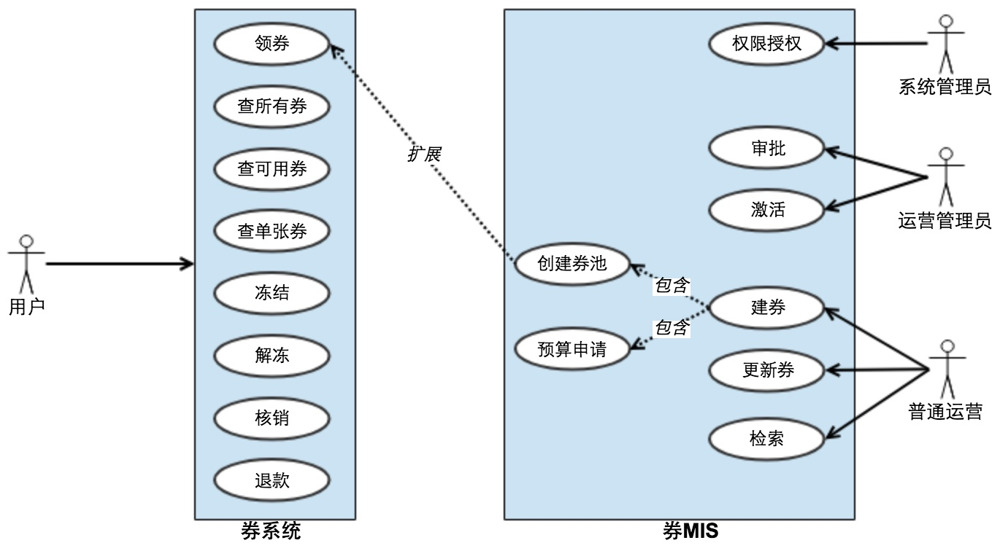

# 背景
## 关于我
PHPer & Gopher，在互联网教育、外贸电商、互联网出行和金融科技等领域积累了一些营销和支付相关的经验。

## 关于营销
**现代营销之父科特勒曾说，旧时代争夺财富的手段是战争，现代则是通过营销手段。**

由此可见，营销在一个产品的生命周期里处于一个关键的地位。关于营销的完整模型，可自行百度 [AARRR模型](https://baike.baidu.com/item/AARRR/6962373?fr=aladdin)。

## 关于本文
本文介绍的是营销的手段之一——券。

比较幸运，在几年前加入一家处于业务高速发展期的创业公司，并从0-1负责搭建了公司的券系统。

作为一名工程师，你是否想知道：
- 系统在公司内处于什么级别？
- 系统如何支撑朋友圈满天飞的券？
- 系统如何支撑每天千万支付订单、亿级金额交易的？
- 稳定性都做了什么工作？

# 系统概述
## 服务等级
一级服务

## 用例图

## 模型

## 核心技术指标
- QPS 峰值10w，TPS 峰值1w
- API 平均耗时20ms，所有API耗时控制在50ms
- 日发券量超1亿张

# 技术实现
## 系统架构图

## 时序图
### 建券

### 发券

### 用券

## 服务高可用方案
作为一级服务，关键量化指标如下：
1. 稳定性要保证99.99%，即全年不可用时长52.56分钟
1. API 耗时保证100ms

> 一级服务，是指参与到业务主流程的服务，属于核心链路，缺少该服务，流程无法流转。

### 措施
**1. 排查系统瓶颈**
- 完善监控和报警，拒绝服务裸奔
- 接入Trace服务，提升问题排查效率
- 全链路压测
- 系统压测，找出API和系统QPS上限
》[a] DB：一次请求的读写次数、索引、读写分离、拆实例、分库分表、做好主从备
》[b] Cache：过期时间是否合理、读写分离、拆实例、做好主从备
 CPU/Mem/IO：CPU密集型还是Mem密集型，耗IO或磁盘不足是因为多打日志
》[c] 存在跨机房调用？
》[d] API分级，根据不同的级别做限流、降级、熔断措施。(是否要分开部署视具体情况)

**2. 建立团队制度和规范**
- 建立技术评审和CR机制
- 上线前要有方案，包括上线步骤、回滚预案、通报机制
- 建立报警响应机制，比如报警必须在X分钟内响应、服务必须在X分钟内恢复、及时在报警处理群同步处理进度
- bad case 要有 case study机制

**3. 培养RD良好的开发意识和习惯**
- 确保对数据一致性高的场景读写都在要在主库
- 散库散表算法要保证数据均匀
- 禁止直接操作线上数据，必须使用API或脚本更新
- 涉及SQL调整要经过DBA审核
- 合理的超时时间设置和重试机制
- 多了解上下游业务
- 对常见bad case要准备好处理工具，比如数据清洗脚本

## 资金安全方案
券是涉及资金的一种营销手段，保证资金安全是重中之重。

### 措施
1. 发券时要进行预算控制，券不能无限量发
2. 用券接入风控，比如限定每人最多一天使用3张券
3. TCC模型 和 对账 两种方式保证分布式系统的数据最终一致性

# Q&A
1. 发券时如何控制预算
》Redis 原子性操作 DECRBY

2. 发券时如何做幂等
》系统间交互要带唯一key，Redis SETNX + MySQL unique key

2. 券码如何保证唯一
》~~MySQL 自增ID~~，~~系统内带时间戳随机生成~~，引入ID生成器(比如snowflake)

3. 未注册用户如何领券
》未注册用户领的券写入临时表(以手机号散表)，当用户点击我的券或用券时，检测同步标识，有则将临时表中的券同步到真实表(以用户id散表)，同步完成，删除同步标识。

4. 领券策略的实现
》上游发券服务实现，这部分逻辑比较重，而且每个业务有个性化需求，不好做收敛

5. 用券规则的实现
》券系统自己实现了规则引擎

6. 使用什么语言开发？
》PHP，期间使用Go重构，下图是对比PHP和Go的性能差异

7. 这么高的QPS/TPS，如何设计缓存和存储？
》系统的性能瓶颈一直都在DB，对DB做了很多优化。DB拆了6个实例、分了1000张，单表数据尽量不超1000w左右(历史数据定期归档)，升级MySQL版本到5.7(单实例一般2w读、2k写没太大压力)；资源隔离，不混部。[MySQL官方压测]( https://www.mysql.com/why-mysql/benchmarks/)、 [MySQL民间压测](http://dimitrik.free.fr/blog/archives/2013/09/mysql-performance-reaching-500k-qps-with-mysql-57.html) 
系统没使用缓存，所有数据都直接查DB，Redis用于计数器、防重入。

9. 整个系统一共使用了多少机器？
》PHP41台(Go6台) + Redis6台 + MySQL18台 + Codis/DBProxy(混部) = 65
