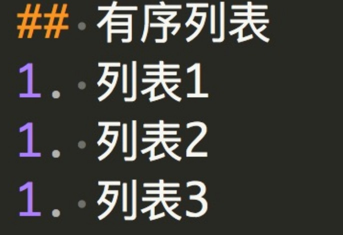

<!-- TOC -->

- [字体相关](#标题)
- [复选框](#复选框)
- [目录](#目录)
- [列表](#列表)
- [分割线](#分割线)
- [图片](#图片)
- [流程图](#流程图)
- [链接](#链接)

<!-- /TOC -->

# 字体相关
# 一级标题 `#一级标题`
## 二级标题 `##二级标题`
### 三级标题 `#### 三级标题`
#### 四级标题 `##### 四级标题`
##### 五级标题 `##### 五级标题`
###### 六级标题 `###### 六级标题`

**这是加粗的文字** `**这是加粗的文字**`
*这是倾斜的文字* `*这是倾斜的文字*`
***这是斜体加粗的文字*** `***这是斜体加粗的文字***`
~~这是加删除线的文字~~ `~~这是加删除线的文字~~`

# 复选框
- [ ] 未选 `- [ ] 未选，注意中间的空格`
- [x] 已选 `- [x] 已选`

# 目录
具体效果参看本文目录，语法如下
```
<!-- TOC -->

- [标题](#标题)
- [复选框](#复选框)

<!-- /TOC -->
```

# 列表
## 无序列表
- 列表1
- 列表2
- 列表3

```
- 列表1 注意中间要使用空格隔开
- 列表2
- 列表3
```

## 有序列表
1. 列表1
1. 列表2
1. 列表3

```
1. 列表1 注意中间要使用空格隔开
1. 列表2
1. 列表3
```

# 分割线
---
`---` 至少3个`-`

# 图片


# 流程图
```flow
st=>start: 开始
op=>operation: My Operation
cond=>condition: Yes or No?
e=>end
st->op->cond
cond(yes)->e
cond(no)->op
&
```

# 链接
点击这里访问 [百度](http://www.baidu.com/)

# 引用
> 这里是引用

`> 这里是引用`

# 表格
表头|表头|表头
---|:--:|---:
内容|内容|内容
内容|内容|内容

```
表头|表头|表头
---|:--:|---:
内容|内容|内容
内容|内容|内容
```
