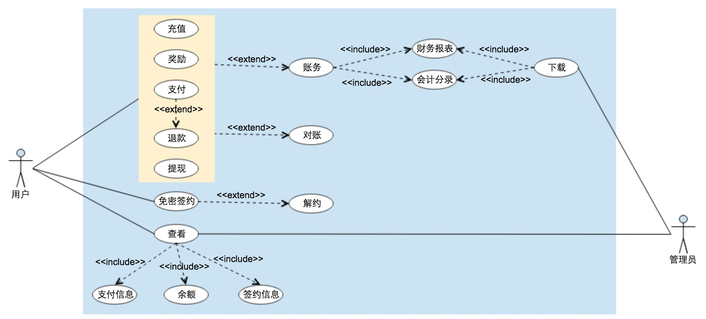
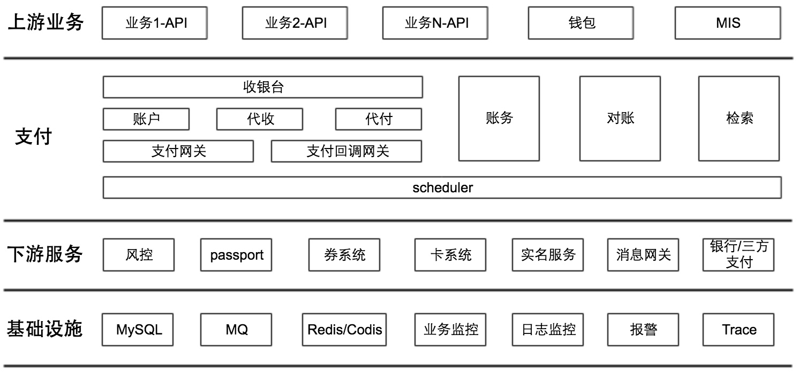
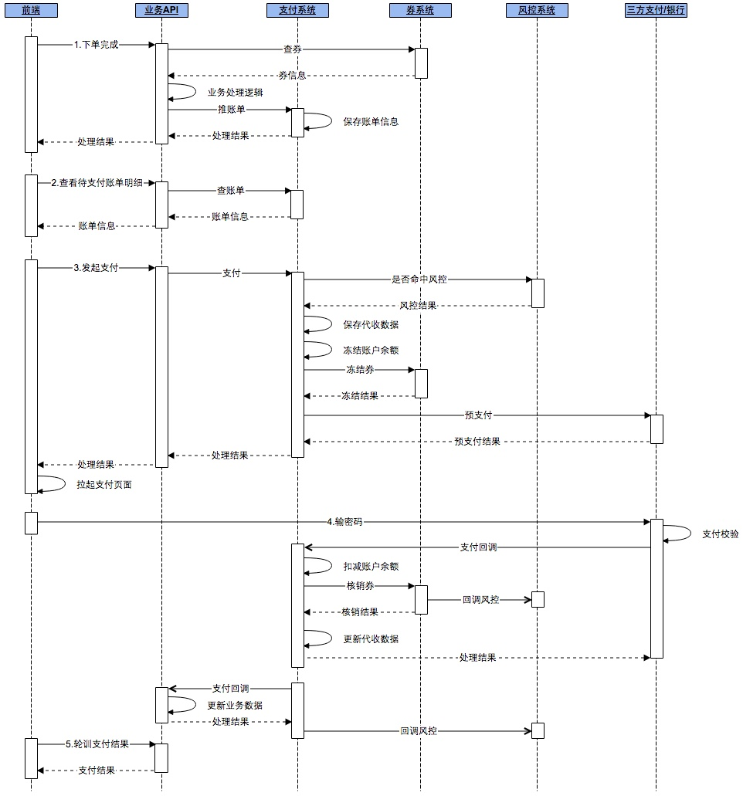
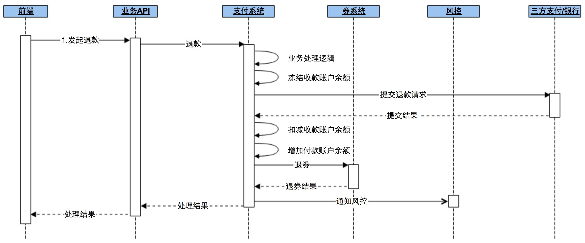
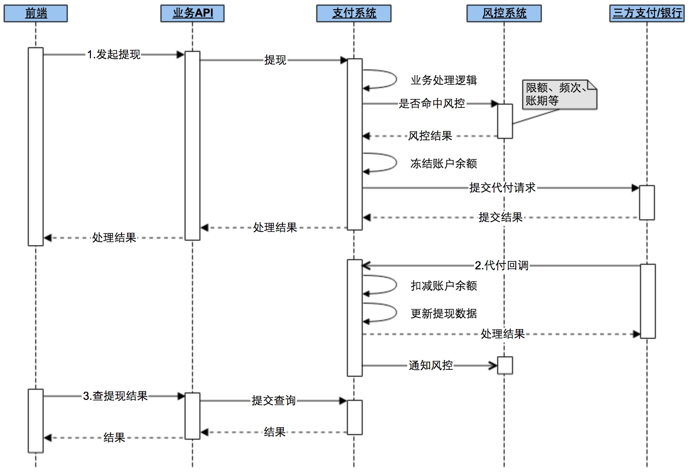

# 背景
## 关于我
PHPer & Gopher，在互联网教育、外贸电商、互联网出行和金融科技等领域积累了一些营销和支付相关的经验。

## 关于在线支付
随着电商的崛起，在线支付逐渐进入大众的视野；2011年以后，随着智能手机的普及和央行下发三方支付牌照，人们开始步入了无现金的消费时代。

目前，在互联网行业中，支付系统在任何一家公司都属于核心系统之一。

## 关于本文
本文介绍的是支付系统的设计和实现。

比较幸运，在几年前加入一家处于业务高速发展期的创业公司，并参与了支付系统的一些设计和实现。

# 系统概述
## 用例图

## 核心指标
- QPS 峰值5k
- API 平均耗时140ms
- 日交易总额达10亿级

# 技术实现
## 系统架构图

## 时序图
### 支付时序图

### 退款时序图

### 提现时序图

# 难点攻坚
1. **支持多账户和热点账户**
多账户：主账户、子账户；  
热点账户：redis decrby，数据一致性最终由对账保证  

3. **分布式数据一致性问题**
所有的数据一致性问题，最终都由对账保证，对账是兜底；  

4. **平台资金安全保障**
业务上-对接风控部门；  
技术上-TCC、幂等、解耦

# 高可用方案
**1. 排查系统瓶颈**
- 完善监控和报警，拒绝服务裸奔
- 接入Trace服务，提升问题排查效率
- 全链路压测
- 系统压测，找出API和系统QPS上限
》[a] DB：一次请求的读写次数、索引、读写分离、拆实例、分库分表、做好主从备
》[b] Cache：过期时间是否合理、读写分离、拆实例、做好主从备
 CPU/Mem/IO：CPU密集型还是Mem密集型，耗IO或磁盘不足是因为多打日志
》[c] 存在跨机房调用？
》[d] API分级，根据不同的级别做限流、降级、熔断措施。(是否要分开部署视具体情况)

**2. 建立团队制度和规范**
- 建立技术评审和CR机制
- 上线前要有方案，包括上线步骤、回滚预案、通报机制
- 建立报警响应机制，比如报警必须在X分钟内响应、服务必须在X分钟内恢复、及时在报警处理群同步处理进度
- bad case 要有 case study机制

# Q&A
1. **如何解决重复支付问题**
上游业务控制；  
redis setnx 控制频次，避免重复支付；  
系统自动退款 or 客服退款； 

2. **自动降级，比如微信支付异常则前端不展示微信支付选项**