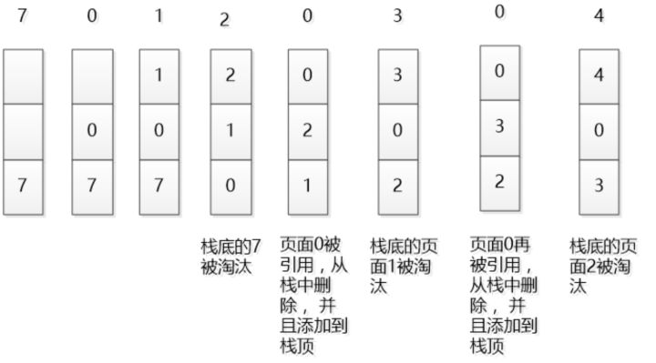

# 常用的内存页面置换算法

## 概述
常见的内存页面置换算法，包括：
1. 先进先出置换算法（FIFO）：这是最简单的页面置换算法。其基本思想是，当需要淘汰一个页面时，总是选择驻留主存时间最长的页面进行淘汰，即先进入主存的页面先淘汰。其理由是，最早调入主存的页面不再被使用的可能性最大。
2. 最优置换算法（OPT）：其基本思想是，从内存中移除永远不再需要的页面；如无这样的页面存在，则选择最长时间不需要访问的页面。其理由是，所选择的被淘汰页面将是以后永不使用的，或是在最长时间内不再被访问的页面，保证获得最低的缺页率。不可能实现，因为无法预知未来。
3. 最近最久未使用（LRU，Least Recently Used）算法：其基本思想是，利用局部性原理，根据过去的页面访问历史来推测未来的行为，即认为过去一段时间里不曾被访问过的页面，在最近的将来可能也不会再被访问。所以，这种算法的实质是，当需要淘汰一个页面时，总是选择在最近一段时间内最久不用的页面予以淘汰。

## LRU实现
### 原理示意图
假设内存可容纳3个页大小，按照 7 0 1 2 0 3 0 4 的次序访问页。假设内存按照栈的方式来描述访问时间，在上面的，是最近访问的，在下面的是，最远时间访问的，LRU就是这样工作的。

> 摘自 https://zhuanlan.zhihu.com/p/34133067

### 需要考虑的问题
1. 如何某页最近是否(未)被访问
1. 如何保证上述查过过程的高性能
1. 如何互换页的位置

## 参考资料
1. [缓存淘汰算法--LRU算法](https://zhuanlan.zhihu.com/p/34989978)
1. [LRU原理和Redis实现——一个今日头条的面试题](https://zhuanlan.zhihu.com/p/34133067)
1. [漫画：什么是LRU算法？](https://zhuanlan.zhihu.com/p/52196637)