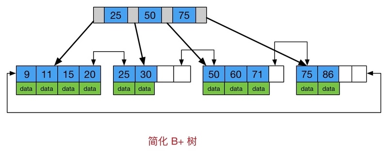

# MySQL索引原理

## 概述
### 索引概念
MySQL官方对索引的定义为：索引(Index)是帮助MySQL高效获取数据的数据结构。索引的本质：索引是数据结构。

### 结论
MySQL索引使用的是B+树。
InnoDB的索引也使用了B+树，因为B+树解决了索引的两个核心问题：
1. 磁盘I/O性能
2. 元素遍历效率

## 计算机原理和数据结构基础
### 计算机组成原理
#### 主存存取原理
目前计算机使用的主存基本都是随机读写存储器（RAM），下图抽象出一个十分简单的存取模型来说明RAM的工作原理。  


主存的存取过程如下：

1. 当系统需要读取主存时，则将地址信号放到地址总线上传给主存，主存读到地址信号后，解析信号并定位到指定存储单元，然后将此存储单元数据放到数据总线上，供其它部件读取。

1. 写主存的过程类似，系统将要写入单元地址和数据分别放在地址总线和数据总线上，主存读取两个总线的内容，做相应的写操作。

> 可以看出，主存存取的时间仅与存取次数呈线性关系，因为不存在机械操作，两次存取的数据的“距离”不会对时间有任何影响，例如，先取A0再取A1和先取A0再取D3的时间消耗是一样的。

#### 磁盘存取原理
与主存不同，磁盘I/O存在机械运动耗费，因此磁盘I/O的时间消耗是巨大的。下图是磁盘的整体结构示意图


一个磁盘由大小相同且同轴的圆形盘片组成，磁盘可以转动（各个磁盘必须同步转动）。在磁盘的一侧有磁头支架，磁头支架固定了一组磁头，每个磁头负责存取一个磁盘的内容，磁头不能转动。

下图是磁盘结构的示意图


盘片被划分成一系列同心环，圆心是盘片中心，每个同心环叫做一个磁道，所有半径相同的磁道组成一个柱面。磁道被沿半径线划分成一个个小的段，每个段叫做一个扇区，每个扇区是磁盘的最小存储单元。

假设磁盘只有一个盘片和一个磁头。当需要从磁盘读取数据时，系统会将数据逻辑地址传给磁盘，磁盘的控制电路按照寻址逻辑将逻辑地址翻译成物理地址，即确定要读的数据在哪个磁道，哪个扇区。为了读取这个扇区的数据，需要将磁头放到这个扇区上方，为了实现这一点，磁头需要移动对准相应磁道，这个过程叫做寻道，所耗费时间叫做寻道时间，然后磁盘旋转将目标扇区旋转到磁头下，这个过程耗费的时间叫做旋转时间。

`在计算机中磁盘存储数据最小单元是扇区，一个扇区的大小是512字节；而文件系统的最小单元是块，一个块的大小是 4k；而InnoDB的最小储存单元是页，一页的大小是16K。`

#### 局部性原理与磁盘预读
> 计算机科学中著名的局部性原理：
> - 当一个数据被用到时，其附近的数据也通常会马上被使用。
> - 程序运行期间所需要的数据通常比较集中。

由于存储介质的特性，磁盘的存取速度很慢，因此为了提高效率，要尽量减少磁盘I/O。为了达到这个目的，基于局部性原理，磁盘不是严格按需读取，而是每次都会预读(预读的长度一般为页的整数倍)，即使只需要一个字节，磁盘也会从这个位置开始，顺序向后读取一定长度的数据放入内存(磁盘顺序读取的效率很高，不需要寻道时间，只需很少的旋转时间)。

### B树
B树是一种多路自平衡的搜索树，它类似普通的平衡二叉树，不同的一点是B树允许每个节点有更多的子节点。下图是 B树的简化图


其特点如下:
1. 所有键值分布在整颗树中
2. 任何一个关键字出现且只出现在一个节点中
3. 搜索有可能在非叶子节点结束
4. 在关键字全集内做一次查找，性能逼近二分查找

查找的伪代码
```php
BTree_Search(node, key) {
  if(node == null) return null;
  foreach(node.key) {
    if(node.key[i] == key) return node.data[i];
    if(node.key[i] > key) return BTree_Search(point[i]->node);
  }
  return BTree_Search(point[i+1]->node);
}
data = BTree_Search(root, my_key);
```

### B+树
B+树是B树的变体，也是一种多路搜索树，下图是B+树的简化图


### 对比B树和B+树
我们发现：
1. B+树所有数据存储在叶子节点，内部节点(非叶子节点并不存储真正的 data)。所以一个内部节点可以存储更多的数据，也意味着B+树单次磁盘I/O的信息量大于B树，I/O效率更高。
2. B+树的所有叶子节点增加了一个带有顺序访问的指针，可在范围区间查询等，而B树每个节点key和data在一起，则无法区间查找。

## MyISAM的索引原理
MyISAM的主索引示意图参看下图：(假设Col1为主键)


MyISAM的辅助索引示意图参看下图：


通过上面的示意图可以看出，MyISAM的索引也是B+树，data域保存数据记录的地址。因此，索引检索的算法为首先按照B+树搜索算法搜索索引，如果指定的Key存在，则取出其data域的值，然后以data域的值为地址，读取相应数据记录。
 
对比MyISAM的主索引和辅助索引，
- MyISAM的索引文件仅仅保存数据记录的地址，且主索引和辅助索引在结构上没有任何区别，只是主索引要求key是唯一的，而辅助索引的key可以重复。

## InnoDB的索引原理

InnoDB的主索引示意图参看下图：(假设Col1为主键)


上图中，InnoDB的数据文件本身按主键聚集，且叶子节点包含了完整的数据记录，这种索引叫做聚集索引。
> 所以InnoDB表必须有主键(MyISAM可以没有)，如果没有显式指定，则MySQL系统会自动选择一个可以唯一标识数据记录的列作为主键，如果不存在这种列，则MySQL自动为InnoDB表生成一个隐含字段作为主键，这个字段长度为6个字节，类型为长整形。

InnoDB辅助索引示意图参看下图：(假设Col1为主键，Col3为辅助索引)


对比InnoDB的主索引和辅助索引，
- InnoDB主索引data域存储了完整的数据记录，而辅助索引data域存储相应记录主键的值，换句话说，InnoDB辅助索引都引用主键作为data域。
- 由于二者存储结构的差异，辅助索引搜索需要检索两遍索引：首先检索辅助索引获得主键，然后用主键到主索引中检索获得记录。
>【面试题：所有的辅助索引都需要检索两遍吗？非也，覆盖索引不需要，因为索引文件已包含需要的所有数据】
>【[面试题：InnoDB中一棵B+树能存多少行数据？](https://zhuanlan.zhihu.com/p/67982911)，约2kw】

## 对比MyISAM和InnoDB
MyISAM的索引也叫做“非聚集索引”的，与之对应的是InnoDB的“聚集索引”。

通过上文，我们可以做出对比，
### 相同点
- 都使用了B+树作为索引结构(但具体实现方式却截然不同)

### 不同点
- InnoDB的数据文件本身就是索引文件；MyISAM索引文件和数据文件是分离的，索引文件仅保存数据记录的地址。
- InnoDB辅助索引data域存储相应记录主键的值；MyISAM辅助索引data域存储的是地址。

> 【面试题：为什么MyISAM的读比InnoDB快？索引文件更小，加载到内存的数据更多】

## 索引的优缺点
### 优点
- 减少查询需要扫描的数据量(加快了查询速度)
- 减少服务器的排序操作和创建临时表的操作(加快了group by和order by等操作)
- 将服务器的随机IO变为顺序IO(加快查询速度).


### 缺点
- 索引会加重插入、删除和修改记录时的负担，降低性能
- MySQL在运行时也要消耗资源维护索引
- 过多的索引可能会导致过高的磁盘使用率以及过高的内存占用，从而影响应用程序的整体性能

一般两种情况下不建议建索引
1. 表记录比较少。例如一两千条记录的表，没必要建索引，让查询做全表扫描就好了。(建议记录数不超过2k不建索引，超过了酌情考虑索引)
2. 索引的选择性较低。比如状态字段只有0/1，区分度太低，不必见索引。(例如SELECT count(DISTINCT(status))/count(1) FROM tb;选择性不足0.0001)

## 索引是如何提升性能的？
开头部分已经提到，提升性能的本质，就是解决`磁盘I/O性能`和`元素遍历效率`两个问题。
> 【面试题：为什么InnoDB使用B+树，so easy！】

### 降低磁盘I/O
当我们要在索引中查找某个key，B+树索引先找到被查找数据行所在的页，接着数据库会把页读入到内存，再在内存中进行查找，最后得到要查找的数据。

随着数据库中数据的增加，索引本身大小随之增加，不可能全部存储在内存中，往往以索引文件的形式存储在磁盘上。这样的话，索引查找过程中就要产生磁盘I/O消耗。可以想象一下一棵几百万节点的二叉树的深度是多少？如果将这么大深度的一颗二叉树放磁盘上，每读取一个节点，需要一次磁盘的I/O读取，整个查找的耗时显然是不能够接受的。那么如何减少查找过程中的I/O存取次数？

结合计算机原理和B+树特性，`解决方法`是减少树的深度，将二叉树变为m叉树（多路搜索树），即B+树，从而最大程度的降低磁盘I/O！！！

### 提升元素遍历效率
MySQL的范围查找问是常见的一种情况，B+树叶节点增加的链指针，加强了区间访问性，可使用在范围区间查询等。
> B树每个节点key和data在一起，则无法区间查找。
> 【面试题：解决了hash索引不能解决的问题】

以`InnoDB主索引示意图`为例，对B+树可以进行两种查找运算：
1. 从最小关键字起顺序查找
2. 从根结点开始，进行随机查找

#### 如果随机查找
从根结点出发，即使在非终端结点上找到了待查的关键字，也不终止，而是继续向下一直到达包含待查关键字的叶子结点。因此，在B+树中，不管随机查找成功与否，每次随机查找都是走了一条从根到叶子结点的路径。

#### 如果顺序查找
从最左侧包含最小关键字的叶子结点出发，不经过分支结点(即非终端结点)，沿着指向下一叶子结点的指针可遍历所有的关键字。

比如查找学校18-22岁的学生人数，可以通过从根节点出发进行随机查找，找到第一个18岁的学生(此时到达了叶子节点)，然后再在叶子节点出发顺序查找到符合范围的所有记录即可。从而提升了效率。

## 高性能索引
了解不同存储引擎的索引实现方式对于正确使用和优化索引都非常有帮助。
> - 例如知道了InnoDB的索引实现后，就很容易明白为什么不建议使用过长的字段作为主键，因为所有辅助索引都引用主索引，过长的主索引会令辅助索引变得过大。
> - 再例如，用非单调的字段作为主键在InnoDB中不是个好主意，因为InnoDB数据文件本身是一颗B+树，非单调的主键会造成在插入新记录时数据文件为了维持B+树的特性而频繁的分裂调整，十分低效，而使用自增字段作为主键则是一个很好的选择。


### 示例数据库
选用MySQL官方文档中提供的示例数据库之一：employees。ER图如下


### 最左前缀原理与相关优化
MySQL中的索引可以以一定顺序引用多个列，这种索引叫做联合索引，一个联合索引是一个有序元组<a1, a2, …, an>，其中各个元素均为数据表的一列。另外，单列索引可以看成联合索引元素数为1的特例。

以employees.titles表为例：

从结果中可以到titles表的主索引为<emp_no, title, from_date>。

#### Case1：全列匹配


我们发现，当按照索引中所有列进行精确匹配（这里精确匹配指“=”或“IN”匹配）时，索引可以被用到；且索引对顺序是不敏感的
> 理论上是敏感的，只是MySQL的查询优化器会自动调整where子句的条件顺序以使用适合的索引

#### Case2：最左前缀匹配

当查询条件精确匹配索引的左边连续一个或几个列时，如<emp_no>或<emp_no, title>，索引也可以被用到，但只能用到一部分，即条件所组成的最左前缀。上面的查询从分析结果看用到了PRIMARY索引，但是key_len为4，说明只用到了索引的第一列前缀。

#### Case3：查询条件用到了索引中列的精确匹配，但中间某条件未提供

此时索引使用情况和`Case2`相同，因为title未提供，所以查询只用到了索引的第一列，而后面的from_date虽在索引中，但是由于title不存在而无法和左前缀连接，因此需要对结果进行扫描过滤from_date（这里由于emp_no唯一，所以不存在扫描）。如果想让from_date也使用索引而不是where过滤，可以增加一个辅助索引<emp_no, from_date>，此时上面的查询会使用这个索引。除此之外，还可以使用一种称之为“隔离列”的优化方法，将emp_no与from_date之间的“坑”填上(忽略)。

#### Case4：查询条件没有指定索引第一列

由于不是最左前缀，用不到索引。

#### Case5：匹配某列的前缀字符串

此时可以用到索引。

#### Case6：范围查询

范围列可以用到索引(必须是最左前缀)，但范围列后面的列无法用到索引。同时，索引最多用于一个范围列，如果查询条件中有两个范围列则无法全用到索引。


可以看到索引对第二个范围索引无能为力。


用了“between”并不意味着是范围查询，可以看到用到了索引。
> 作用于emp_no上的“BETWEEN”实际上相当于“IN”，也就是说emp_no实际是多值精确匹配

#### Case7：查询条件中含有函数或表达式

如果查询条件中含有函数或表达式，则MySQL不会为这列使用索引。


### InnoDB的主键选择与插入优化
使用InnoDB存储引擎，如无特别需要，请使用一个与业务无关的自增字段作为主键！！！
使用InnoDB存储引擎，如无特别需要，请使用一个与业务无关的自增字段作为主键！！！
使用InnoDB存储引擎，如无特别需要，请使用一个与业务无关的自增字段作为主键！！！

InnoDB使用聚集索引，数据记录本身被存于主索引的叶子节点上。这就要求同一个叶子节点内(大小为一个内存页或磁盘页)的各条数据记录按主键顺序存放，因此每当有一条新的记录插入时，MySQL会根据其主键将其插入适当的节点和位置，如果页面达到装载因子（InnoDB默认为15/16），则开辟一个新的页(节点)。

#### 如果表使用自增主键
每次插入新的记录，记录就会顺序添加到当前索引节点的后续位置，不需要移动已有数据，也不会增加很多开销在维护索引上，当一页写满，就会自动开辟一个新的页。最终形成一个紧凑的索引结构，近似顺序填满。因此效率很高。如下图所示：


#### 如果使用非自增主键
由于每次插入主键的值近似于随机，每次新纪录都要被插到现有索引页得中间某个位置，此时MySQL不得不为了将新记录插到合适位置而移动数据，甚至目标页面可能已经被回写到磁盘上而从缓存中清掉，此时又要从磁盘上读回来，这增加了很多开销，同时频繁的移动、分页操作造成了大量的碎片，得到了不够紧凑的索引结构，后续不得不通过OPTIMIZE TABLE来重建表并优化填充页面。如下图所示：


> 【面试题：使用数据库自增主键的好处？】

## 参看资料
1. [由 B-/B+树看 MySQL索引结构](https://segmentfault.com/a/1190000004690721)
2. [MySQL索引背后的数据结构及算法原理](http://blog.codinglabs.org/articles/theory-of-mysql-index.html)
3. [MySQL逻辑架构及性能优化原理](https://blog.csdn.net/fuzhongmin05/article/details/70904190)
4. [浅谈MySQL的B树索引与索引优化](https://monkeysayhi.github.io/2018/03/06/浅谈MySQL的B树索引与索引优化/)
