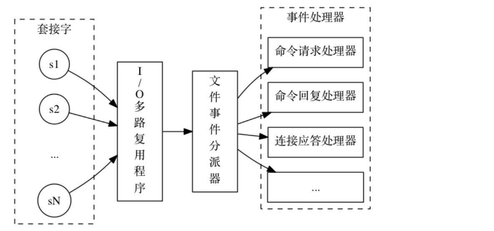
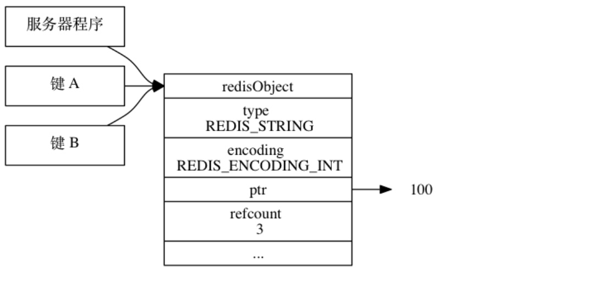
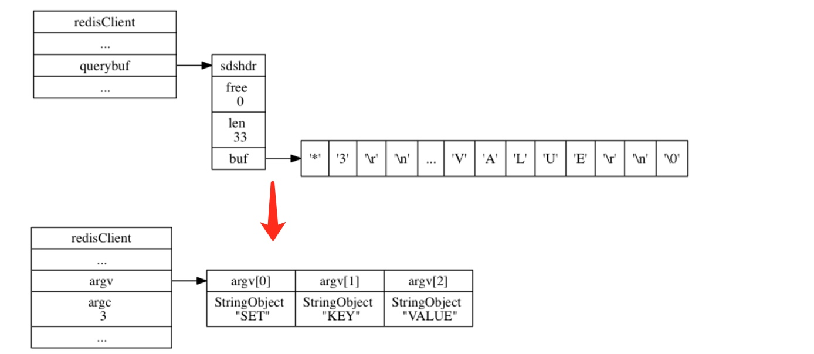
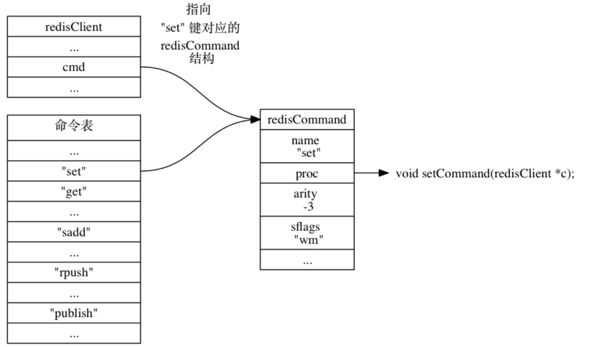
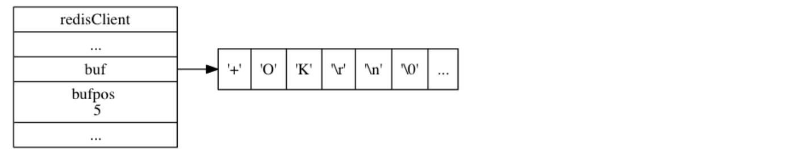
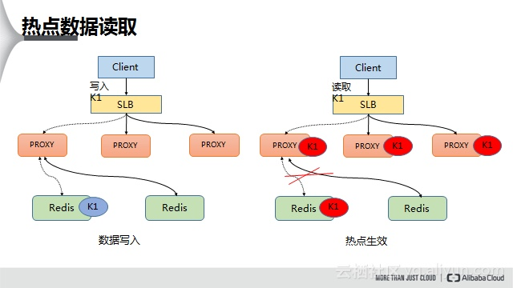
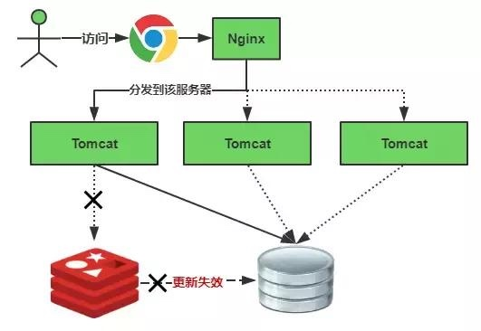

# 理解Redis

## 前言
Redis是一个开源(BSD许可)的，内存中的数据结构存储系统，它可以用作数据库、缓存和消息中间件。
> Redis = Remote Dictionary Service

Redis以其超高的性能、完美的文档、简洁易懂的源码和丰富的客户端库支持在开源中间件领域广受好评，并成为互联网技术领域使用最为广泛的存储中间件之一。

> 赶紧试试 [官方提供的在线命令学习工具](http://try.redis.io/)

## 关于线程IO模型和通信协议
### 线程IO模型
Redis是单进程，同时对外提供服务使用的是单线程！  
Redis是单进程，同时对外提供服务使用的是单线程！  
Redis是单进程，同时对外提供服务使用的是单线程！  

因为Redis所有的数据都在内存中，所有的运算都是内存级别的运算，所以运算很快，整体时间主要消耗在网络传输上。
> 也正因为是单线程，天然就支持了原子操作，但一些时间复杂度较高的指令，一不小心就可能会导致卡顿

同时，由于使用了非阻塞IO，所以可以处理客户端的高并发连接。

其文件事件处理器如下图所示，  
  
  
> I/O多路复用程序负责监听多个套接字，并向文件事件分派器传送那些产生了事件的套接字

> 【提问：Redis如何使用单进程单线程支撑高并发？】

### 通信协议
Redis的通信协议是RESP(即Redis Serialization Protocol)，它是一种直观的文本协议，优势在于实现异常简单，解析性能极好；不足在于数据传输比较浪费流量。

RESP将传输的结构数据分为5种类型，且结束时统一加上回车换行符号`\r\n`，分别是
1. 单行字符串 以 + 符号开头
2. 多行字符串 以 $ 符号开头，后跟字符串长度
3. 整数值 以 : 符号开头，后跟整数的字符串形式
4. 错误消息 以 - 符号开头
5. 数组 以 * 号开头，后跟数组的长度

## 关于内存回收&对象共享
因为C语言并不具备自动的内存回收功能，所以Redis在自己的对象系统中通过构建了一个引用计数实现了内存回收机制。

每个对象的引用计数信息由redisObject结构的refcount属性记录：
```c
typedef struct redisObject {
    // ...
    // 引用计数
    int refcount;
    // ...
} robj;
```

对象的引用计数信息会随着对象的使用状态而不断变化：
- 在创建一个新对象时， 引用计数的值会被初始化为1
- 当对象被一个新程序使用时， 它的引用计数值会被+1
- 当对象不再被一个程序使用时， 它的引用计数值会被-1
- 当对象的引用计数值变为0时， 对象所占用的内存会被释放

此外， 对象的引用计数属性还带有对象共享的作用，以便节省内存，如图所示：  


## 关于命令请求的执行过程
> 服务器经过初始化之后，才能开始接受命令

客户端执行命令`SET KEY VALUE`，并得到返回值`OK`，这个过程经历了：
1. 用户执行命令后，客户端C调用写入函数，将协议数据`*3\r\n$3\r\nSET\r\n$3\r\nKEY\r\n$5\r\nVALUE\r\n`通过套接字向服务器S传送
1. 当S的文件事件处理器执行时，它会察觉到C所对应的读事件已经就绪，于是将协议文本读入，并保存到C对应的redisClient结构的查询缓存中
1. S对查询缓存中数据分析，从命令表中查找相应命令SET的实现函数
1. S执行命令的实现函数，修改全局状态server变量，并将命令的执行结果保存到C对应的redisClient结构的回复缓存中，然后为C的fd关联写事件
1. 当C的fd写事件就绪时，将回复缓存中的命令结果`OK`传回给客户端
2. 打印`OK`给用户，命令执行完毕

### 发送命令
当用户在C中输入一个命令请求时，C将命令请求转换成协议格式，然后通过套接字连接和传送到S，如下图所示，  


### S读取命令数据
S对输入缓冲区中的命令请求进行分析，提取出命令请求中包含的参数、参数的个数，然后分别将参数和参数个数保存到C状态的argv和argc里面。如下图所示，  


### 从命令表查找命令
命令执行器首先要做的是根据C状态的argv[0]参数，在命令表中查找参数所指定的命令，找到后返回"set"键所对应的redisCommand结构，C状态的cmd 指针会指向这个redisCommand结构。如下图所示，  


### 执行命令
在真正执行命令之前，会先做一些校验，
1. 检查C状态的cmd指针是否指向 NULL
1. 检查C的cmd属性指向的redisCommand结构的arity属性，是否小于命令请求所给定的参数个数
1. 检查C是否已经通过了身份验证
1. 如果S打开了maxmemory功能，检查S的内存占用情况，并在有需要时进行内存回收
2. 如果S上一次执行BGSAVE命令时出错，且S打开了stop-writes-on-bgsave-error功能，且S即将要执行的命令是一个写命令，那么S将拒绝执行这个命令
3. 如果C当前正在用SUBSCRIBE或PSUBSCRIBE命令订阅，那么S只会执行客户端发来的SUBSCRIBE、PSUBSCRIBE、UNSUBSCRIBE、PUNSUBSCRIBE命令
1. 如果S正在数据载入， 那么C发送的命令必须带有l标识才会被S执行
1. 如果S因为执行Lua而超时并进入阻塞状态，那么S只会执行SHUTDOWN nosave命令和SCRIPT KILL命令
1. 如果C正在执行事务，那么S只会执行C的EXEC、DISCARD、MULTI、WATCH四个命令
1. 如果S打开了监视器功能，那么S会将要执行的命令和参数等信息发送给监视器

校验完成之后，结合上面的示意图，最终真正执行的是`setCommand(client);`，并把结果保存到RedisClient结构的回复缓存中，如下图所示，  



执行命令完成后，还可能进行：
1. 记录慢日志
2. 写AOF日志
3. 复制命令给从库

### 将结果返回给C并显示
当C套接字变为可写状态时，S就会执行命令回复处理器，将保存在输出缓冲区中的命令回复发送给C，并在发送完毕之后清空输出缓冲区，为处理下一个命令请求做好准备。同时，C解析返回结果并显示给用户，如下图所示，  


## 关于事务
- 不具备原子性——不支持回滚
- 不具备严格的持久性
- 不支持严格的一致性
- 支持隔离性——单进程单线程

## 关于Redis基础数据结构
详情请参看[理解Redis基础数据结构](https://github.com/chungwei/imiao/blob/master/存储/101-理解Redis基础数据结构.md)

## 关于Redis持久化
详情请参看[理解Redis持久化的实现](https://github.com/chungwei/imiao/blob/master/存储/102-理解Redis持久化的实现.md)

## 关于Redis内存管理策略
详情请参看[理解Redis内存管理策略](https://github.com/chungwei/imiao/blob/master/存储/103-理解Redis内存管理策略.md)

## 经典案例分析和最佳实践
### mc和Redis选型
老生常谈的话题，看业务场景和团队情况吧。

### 热key解决方案
比如某个热点新闻出现，很有可能会产生热key。

#### 热key的危害
1. 流量集中，达到物理网卡上限
2. 请求过多，缓存分片服务被打垮
3. DB 击穿，引起业务雪崩

#### 发现热key
1. 根据业务经验：比如某商品在做秒杀，这个商品的key就可以判断出是热key
2. 在client侵入代码进行统计
3. 在proxy层收集和上报
4. 使用Redis工具，如`monitor`、`hotkeys`

#### 解决办法
1. 本地缓存
2. proxy层缓存
3. 读写分离集群

下图是阿里的解决方案：  


### 统计类场景
使用位图 或 HyperLogLog。二者的区别，
- 位图：适合统计用户在某段时间内签到了多少天
- HyperLogLog：适合统计某页面当天的UV，因为有去重逻辑，但不精确

> 【提问：[拼多多面试真题：如何用Redis统计独立用户访问量](https://zhuanlan.zhihu.com/p/69425231)】  
> 【提问：[面试题之redis实现限制1小时内每用户Id最多只能登录5次](https://www.cnblogs.com/wujf/p/5206354.html)】

### 海量数据存储
#### 对bigkey的处理
为防止网卡流量、慢查询，首先应该想到的是拒绝bigkey。
> string类型控制在10KB以内，hash、list、set、zset元素个数不要超过5000。有一些工具可以帮忙我们发现bigkey，如命令`redis-cli --bigkeys`

#### 合理的数据删除策略
如果出现了非字符串的bigkey，不要使用del删除，使用hscan、sscan、zscan方式渐进式删除，同时要注意防止bigkey过期时间自动删除问题。
> 例如一个200万的zset设置1小时过期，会触发del操作，造成阻塞，而且该操作不会出现在慢查询中(latency可查)。Redis4.0已经支持key的异步删除。

#### 选择适合的数据类型
达到节省内存和性能之间的平衡。

#### 设置合理的过期时间
使用expire设置过期时间(条件允许可以打散过期时间，防止集中过期)。

#### 使用合适的命令访问数据
1. 避免使用O(n)的命令，如使用scan而不是keys，虽然二者的时间复杂度都是O(n)，但scan使用了游标，不会导致卡顿
1. 避免使用select
2. 避免使用事务
2. 使用批量操作提高效率，如能使用mget、mset的场景，就不要循环进行get、set

### 分布式锁
基于Redis实现的分布式锁，
1. setnx
2. redlock

### 高可用方案
#### 缓存雪崩
缓存雪崩可以简单的理解为：由于原有缓存失效，新缓存未到期间(例如：我们设置缓存时采用了相同的过期时间，在同一时刻出现大面积的缓存过期)，所有原本应该访问缓存的请求都去查询数据库了，而对数据库CPU和内存造成巨大压力，严重的会造成数据库宕机。从而形成一系列连锁反应，造成整个系统崩溃。  

缓存失效瞬间示意图如下：


解决方案：
- 大多数情况考虑用加锁或者队列的方式保证缓存的单线程(进程)写，从而避免失效时大量的并发请求落到底层存储系统上。

#### 缓存穿透
缓存穿透是指用户查询数据，在数据库没有，自然在缓存中也不会有。这样就导致用户查询的时候，在缓存中找不到，每次都要去数据库再查询一遍，然后返回空(相当于进行了两次无用的查询)。

解决方案：
- 最常见的则是采用布隆过滤器，将所有可能存在的数据哈希到一个足够大的bitmap中，一个一定不存在的数据会被 这个bitmap拦截掉，从而避免了对底层存储系统的查询压力
- 简单粗暴的方法，如果一个查询返回的数据为空(不管是数据不存在，还是系统故障)，仍然缓存这个空结果，但它的过期时间会很短

#### 缓存击穿
某个热key在某个时间点过期，恰好在这个时间点对这个key有大量的并发请求过来，这些请求发现缓存过期一般都会从后端DB加载数据并回设到缓存，这个时候大并发的请求可能会瞬间把后端DB压垮。
> 这个和缓存雪崩的区别在于这里针对某一key缓存，雪崩则是很多key

解决方案：
- 简单分布式互斥锁，如Redis的setnx

#### 分布式高可用
详情请参看[Redis分布式高可用架构](https://github.com/chungwei/imiao/blob/master/存储/104-Redis分布式高可用架构.md)

## 参考资料
1. [热点Key的发现与解决之道](https://yq.aliyun.com/articles/404817)
1. [如何发现Redis热点Key，解决方案有哪些？](https://mp.weixin.qq.com/s?__biz=MzUyNDkzNzczNQ==&mid=2247486805&idx=1&sn=55dd5c2d296b097470fbde17a4e3c3d6&chksm=fa24f23dcd537b2b0a7eef2e20f604980adc58fdc066324bf7eed35ab156e38f87c3166bce7f&scene=21#wechat_redirect)
1. [Redis 分布式锁进化史解读 + 缺陷分析](https://mp.weixin.qq.com/s?__biz=MzA5ODM5MDU3MA==&mid=2650864919&idx=1&sn=f9d2218155e7c4a2c04d57970ede4160&chksm=8b661a52bc119344bffbc46292d162163525c9525b3c507bdab23e425494d6e58ab6a364e046&mpshare=1&scene=24&srcid=0220xpwaWSmhP1XEnhtWZxYc&key=51937ec95710ec6392c5232e6c2494e17f5ce044d1b68f3c350a03481b32139b460cb496c8292e10ef498ebcd29614411d76b5832c2bf45218210f70490eae05fa5a184c01e2a3c12aea6029b5da8e8d&ascene=0&uin=Nzc3MzQ2MTgy)
1. [Redis 设计与实现[第1版]](https://redisbook.readthedocs.io/en/latest/index.html)
2. [Redis 设计与实现](http://redisbook.com/)
1. [缓存穿透，缓存击穿，缓存雪崩解决方案分析](https://blog.csdn.net/zeb_perfect/article/details/54135506)
1. [Redis系列十：缓存雪崩、缓存穿透、缓存预热、缓存更新、缓存降级](https://www.cnblogs.com/leeSmall/p/8594542.html)
1. [Hello Redis，我有7个问题想请教你](https://mp.weixin.qq.com/s?__biz=MzI1NDQ3MjQxNA==&mid=2247489614&idx=1&sn=803113aa84dfc6796bc93b73903d845d&chksm=e9c5e1ffdeb268e9899349abd769e3459b8dc33f225379c8fa10b55abafa12b8f0b477b45b2c&mpshare=1&scene=24&srcid=&key=51937ec95710ec63deca9e2191d31f40f932318dc82b6ff31b346a33b5908f0cdfd64453e36343259eadee65380a3c392f7a91ec8f54666dad0ea01c3e14b49f9070796e0f7008684968518a3d369794&ascene=0&uin=Nzc3MzQ2MTgy&nettype=WIFI&lang=zh_CN&fontScale=100&pass_ticket=6AHO5gBAReB43RtRd6u0irzM75OfuXjdb5Xs9RdAMSwoieMLW7ic1%2Bjsd1djK0Ay)
2. [Redis 总体结构图](http://www.okyes.me/2016/07/18/redis-1.html)
3. [选redis还是memcache，源码怎么说？](https://mp.weixin.qq.com/s?__biz=MjM5ODYxMDA5OQ==&mid=2651961272&idx=1&sn=79ad515b013b0ffc33324db86ba0f834&chksm=bd2d02648a5a8b728db094312f55574ec521b30e3de8aacf1d2d948a3ac24dbf30e835089fa7&scene=21#wechat_redirect)
