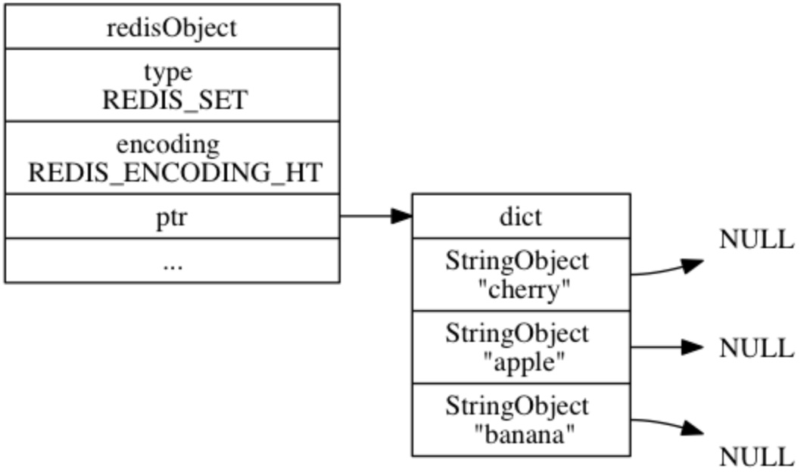

# 理解Redis基础数据结构

## 前言
相对于Memcache，很多人选择Redis是由于它支持丰富的数据结构，包括字符串(strings)、哈希(hashes)、列表(lists)、集合(sets)，有序集合(sorted sets)。

那么，我们不禁会问，
- Redis的数据结构分别在什么场景适用？
- Redis的数据结构底层是如何实现的？
- Redis的数据结构是如何做到尽可能节省内存的？

通过如下示意图我们先整体了解一下：  
### 主要数据结构
  

### 主要数据结构之间的关系
  

## 内存数据结构
### SDS
SDS与传统C字符串的区别就是SDS是结构化的，它可以高效的处理分配、回收、长度计算O(1)等问题。
> SDS=Simple Dynamic String

#### SDS示意图
  

> **注意：**
> SDS有两种存储方式，在长度特别短时，使用emb形式存储(embeded)；当长度超过44时，使用raw形式存储。

#### SDS的扩容策略
- 字符串在长度小于1M之前，扩容空间采用加倍策略，也就是保留100%的冗余空间
- 当长度超过1M之后，为了避免加倍后的冗余空间过大而导致浪费，每次扩容只会多分配1M大小的冗余空间
> 最大限度减少修改字符串长度时所需的内存重分配次数

### 双链表
#### 双链表示意图

#### 特性
1. 节点带有前驱和后继指针，访问前驱节点和后继节点的复杂度为O(1)，且对链表的迭代可以在从表头到表尾和从表尾到表头两个方向进行
1. 链表带有指向表头和表尾的指针，对表头和表尾进行处理的复杂度为O(1)
1. 链表带有记录节点数量的属性，在O(1)复杂度内返回链表长度

### 字典
#### 字典示意图
  

可以看出，结构上它使用二维结构，第一维是数组，第二维是链表，hash的内容key和value存放在链表中，数组里存放的是链表的头指针。通过key查找元素时，先计算key的hashcode，然后用hashcode对数组的长度进行取模定位到链表的表头，再对链表进行遍历获取到相应的value值，链表的作用就是用来将产生了「hash碰撞」的元素串起来。  

### 添加键值对
往空白字典添加了第一个键值对  
  

添加新键值对时发生碰撞处理  

### rehash
为了在字典的键值对不断增多的情况下保持良好的性能，字典需要对所使用的哈希表(ht[0])进行rehash操作，扩大至2倍。

每次向字典添加新键值对之前，都会对ht[0]进行检查，如果比率ratio=used/size满足以下任何一个条件的话，rehash过程就会被激活：
1. 自然rehash：ratio>=1 ，且变量dict_can_resize为真(正在持久化时为假)
1. 强制rehash：ratio>dict_force_resize_ratio

#### 扩容实现过程示意图

> 需要特别指出的是，rehash并不是在激活之后，就马上执行直到完成的(可能导致卡顿)，而是分多次、渐进式地完成的。

期间，
- 所有查找、删除等操作，除了在ht[0]上进行，还需要在ht[1]上进行
- 添加操作，新的节点会直接添加到ht[1]而不是ht[0]，这样保证ht[0]的节点数量只减不增

### 缩容
Redis的hash结构不但有扩容还有缩容。缩容的原理和扩容是一致的，只不过新的数组大小要比旧数组小一倍。

## 跳跃表
跳跃表(skiplist)是一种有序数据结构，它通过在每个节点中维持多个指向其他节点的指针，从而达到快速访问节点的目的。
> 平均O(log N)、最坏O(N)的时间复杂度

用途：Redis 只在两个地方用到了跳跃表， 一个是实现有序集合键， 另一个是在集群节点中用作内部数据结构。

## 整数集合
整数集合(intset)用于有序、无重复地保存多个整数值，根据元素的值，自动选择该用什么长度的整数类型来保存元素。  
> 如果在一个intset里，最长的元素用int16_t，那么所有元素都以int16_t类型来保存；另一方面，如果有一个新元素int32_t要加入到这个intset，那么这个intset会自动进行“升级”，即先将现有的所有元素从int16_t转换为int32_t，接着再将新元素加入到集合中

需要注意的是，intset不支持降级。

Redis使用整数集合作为集合键的底层实现，说明该集合：
1. 只包含整数值元素
1. 元素数量不多

### 添加新元素
添加新元素到intset，需要处理以下三种情况：
1. 元素已存在于集合，不做动作
2. 元素不存在于集合，并且添加新元素并不需要升级
3. 元素不存在于集合，但是要在升级之后，才能添加新元素

## 压缩列表
ziplist是由一系列特殊编码的内存块构成的列表，一个ziplist可以包含多个节点，每个节点可以保存一个长度受限的字符数组(不以\0结尾的char数组)或整数， 包括：
1. 字符数组
   - 长度小于等于63(2^6−1)字节的字符数组
   - 长度小于等于16383(2^14−1)字节的字符数组
   - 长度小于等于4294967295(2^32−1)字节的字符数组
1. 整数
   - 4位长，介于0-12之间的无符号整数
   - 1字节长，有符号整数
   - 3字节长，有符号整数
   - int16_t类型整数
   - int32_t类型整数
   - int64_t类型整数

其结构如下图所示，  
  

通过压缩数据存储在一块连续的内存空间中，最终节省内存。  

### 优缺点
- 最大的优点就是压缩空间，空间利用率很高。
- 缺点就是一旦出现更新可能就是连锁更新，因为数据在内容空间中都是连续的，最极端情况下就是可能出现顺序连锁扩张。

### 使用场景
当一个列表键只包含少量列表项，并且每个列表项要么就是小整数值，要么就是长度比较短的字符串，那么Redis就会使用压缩列表来做列表键的底层实现。

## Redis数据结构
## 字符串的实现
Redis使用得最为广泛的数据类型，所有涉及到字符串的地方都是使用SDS实现。其实现依赖的底层数据结构如下图所示，  

  

### 编码的选择
字符串类型分别使用REDIS_ENCODING_INT和REDIS_ENCODING_RAW两种编码。

1. 新创建的字符串默认使用REDIS_ENCODING_RAW编码
1. 在将字符串作为键或者值保存进数据库时，程序会尝试将字符串转为REDIS_ENCODING_INT编码

## 哈希的实现
其实现依赖的底层数据结构如下图所示，  

### 编码的选择
1. 创建空白哈希表时， 程序默认使用压缩表
2. 当以下满足其一时，编码将从压缩表切换为字典：
    - 哈希表中某个键或某个值的>64字节[可配]
    - 压缩列表中的节点数量>512个[可配]

当哈希表使用字典编码时，程序将哈希表的key保存为字典的key，将哈希表的值保存为字典的值。
> 哈希表所使用的字典的键和值都是字符串对象。

## 列表的实现
其实现依赖的底层数据结构如下图所示，  

### 编码的选择
1. 创建新列表默认使用压缩表
2. 当以下满足其一时，编码将从压缩表切换为双链表：
    - 往列表新添加一个字符串值，且这个字符串的长度>64字节[可配]
    - 压缩列表中的节点数量>512个[可配]

### 关于阻塞
BLPOP、BRPOP和BRPOPLPUSH三个命令都可能造成客户端被阻塞，以下将这些命令统称为列表的阻塞原语。

阻塞原语并不是一定会造成客户端阻塞：
1. 只有当这些命令被用于空列表时，它们才会阻塞客户端
1. 如果被处理的列表不为空的话，它们就执行无阻塞版本的LPOP、RPOP或RPOPLPUSH命令

阻塞一个客户端需要执行以下步骤：
1. 将客户端状态设为“正在阻塞”，并记录阻塞这个客户端的各个键，以及阻塞的timeout等数据。
1. 将客户端信息记录到server.db[i]->blocking_keys(其中i为客户端所使用的数据库号码)
1. 继续维持客户端和服务器之间的网络连接，但不再向客户端传送任何信息，造成客户端阻塞

第2步入下图所示，  

> 在上图展示的blocking_keys，client2、client5、client1三个客户端就正被key1阻塞，而其他几个客户端也正在被别的两个key阻塞

当客户端被阻塞之后，脱离阻塞状态有以下三种方法：
1. 被动脱离：有其他客户端为造成阻塞的key推入了新元素
1. 主动脱离：到达执行阻塞原语时设定的timeout
1. 强制脱离：客户端强制终止和服务器的连接，或者服务器停机

## 集合的实现
其实现依赖的底层数据结构如下图所示，  

  
  

### 编码的选择
第1个添加到集合的元素，决定了创建集合时所使用的编码：
- 第1个元素可以表示为一个整数，那么集合的初始编码为intset
- 否则，集合的初始编码为字典

当以下满足其一时，编码将从intset切换为字典：
- intset保存的整数值个数>512个
- 添加一个不是整数的新元素

## 有序集合的实现
其实现依赖的底层数据结构如下图所示，  

  
  

### 编码的选择
添加到集合的元素，决定了创建集合时所使用的编码：
- 元素符合以下条件的话，就创建一压缩表的有序集，
    - 服务器属性server.zset_max_ziplist_entries<128(默认128)
    - 元素的member长度<服务器属性server.zset_max_ziplist_value(默认64)
- 否则，不管是第1个或者后面添加的元素，只要不满足上诉条件，编码都为跳跃表

### 为什么有序集合需要同时使用跳跃表和字典来实现？
理论上，有序集合可单独使用字典或跳跃表的其中一种数据结构来实现，但性能上对比起同时使用字典和跳跃表都会有所降低。

如果我们只使用字典来实现有序集合，那么虽然以O(1)复杂度查找成员的分值这一特性会被保留，但因为字典以无序的方式来保存集合元素，所以每次在执行范围型操作都需要进行排序，至少O(NlogN) 时间复杂度和O(N)的内存空间。

另一方面，如果我们只使用跳跃表来实现有序集合， 那么跳跃表执行范围型操作的所有优点都会被保留，但因为没有了字典，所以根据成员查找分值这一操作的复杂度将从O(1)上升为O(logN)。

## 参考资料
1. [Redis存储总是心里没底？你大概漏了这些数据结构原理](https://mp.weixin.qq.com/s?__biz=MzI4NTA1MDEwNg==&mid=2650773777&idx=1&sn=6b35b1527dea6e201f51ddf0175ccd10&chksm=f3f92c84c48ea592b836600638e95eb46344e5bb1699cad27ba80b2801944542320ef4e34cf9&mpshare=1&scene=24&srcid=0107LvM3cFkIJRaT7e6HmudQ&key=5f61bbc2a59beb948b7e190f78de5cc04ac0b4000e8cf53c5e94c53efa0c2dfd15fe5eefb5dc5b968211370dcc62259b208c5de4940338df3a7c9889da2d1e6cb4b13ec6714187771d4f2fe7ef4e1ba9&ascene=0&uin=Nzc3MzQ2MTgy)
2. [通俗易懂的Redis数据结构基础教程](https://juejin.im/post/5b53ee7e5188251aaa2d2e16)
1. [Redis 设计与实现[第1版]](https://redisbook.readthedocs.io/en/latest/index.html)
2. [Redis 设计与实现](http://redisbook.com/)