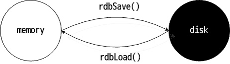
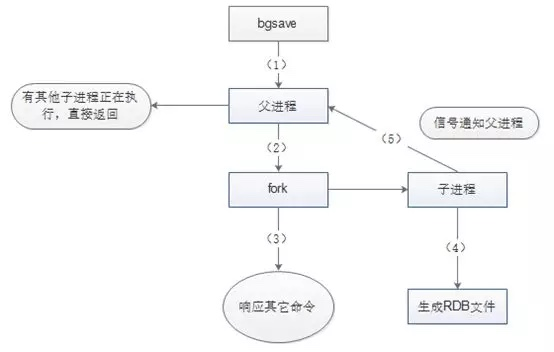
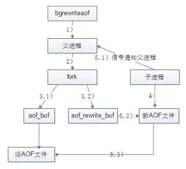
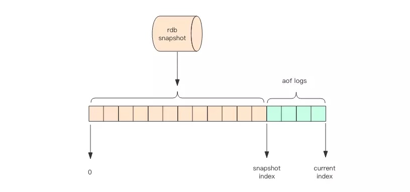

# 理解Redis持久化的实现
## 前言
Redis为了高性能，数据都是存储在内存中。如果突然宕机，那么数据就会丢失，所以需要有某种机制来确保数据不会丢失——这种机制就是持久化。

持久化的实现有两种方式，
- RDB
- AOF日志

## RDB方式的实现
RDB是默认的持久化方案。在指定的时间间隔内，执行指定次数的写操作，则会将内存中的数据全量写入到磁盘。即在指定目录下生成一个dump.rdb文件。Redis重启会通过加载dump.rdb文件恢复数据。如下图所示：  

Redis使用OS的多进程COW(Copy On Write)机制来实现RDB持久化，以此来确保dump过程中的文件IO操作不会阻塞线上的业务，达到边持久化边响应客户端请求。

### 具体实现
Redis在持久化时调用glibc的函数fork产生一个子进程，RDB完全交给子进程来处理，父进程继续处理客户端请求。子进程刚刚产生时，它和父进程共享内存里面的代码段和数据段。这是Linux OS的机制，在进程分离的一瞬间，内存的增长几乎没有明显变化，节约了内存资源。  

子进程做数据持久化，不会修改现有的内存数据，只对数据结构进行遍历读取，然后序列化写入磁盘。但父进程仍持续服务客户端请求，并对内存数据进行不间断的修改。  

此时使用OS的COW机制来进行数据段页面的分离。数据段是由很多OS的页面组合而成，当父进程对其中一个页面的数据进行修改时，会将被共享的页面复制一份分离出来，然后对这个复制的页面进行修改。这时子进程相应的页面是没有变化的，还是进程产生时那一瞬间的数据。  

随着父进程修改操作的进行，越来越多的共享页面被分离出来，内存就会持续增长。但不会超过原有数据内存的2倍。另外，一个Redis实例里冷数据占的比例往往是比较高的，所以很少会出现所有的页面都会被分离，被分离的往往只有其中一部分页面。每个页面的大小4K，一个Redis实例里面一般都会有成千上万的页面。

子进程因为数据没有变化，它能看到的内存里的数据在进程产生的一瞬间就凝固不变了，这也是为什么RDB也叫「快照」的原因。接下来子进程就可以非常安心的遍历数据进行序列化写磁盘了，最终完成了持久化。  

`bgsave`命令的执行流程，如下图所示：  

### 触发RDB方式
1. 在指定的时间间隔内，执行指定次数的写操作
2. 执行save(阻塞，只管保存快照，其他的等待)或bgsave(异步)命令
3. 执行flushall命令，清空数据库所有数据，意义不大
4. 执行shutdown命令，保证服务器正常关闭且不丢失任何数据，意义不大

## AOF日志方式的实现
AOF出现是为了弥补RDB的不足(数据的不一致性)。  

### 触发AOF方式
根据配置文件触发，可以是
- 每次执行触发
- 每秒触发

### 具体实现
AOF采用日志的形式来记录每个写操作，并追加到文件中。Redis重启的会根据日志文件的内容将写指令从前到后执行一次以完成数据的恢复工作。如下图所示： 

Redis收到客户端修改指令后，进行参数校验和进行逻辑处理后，如果没问题，立即将内容写到了内核为文件描述符分配的一个内存缓存中，然后内核会异步将脏数据刷到磁盘的日志文件。
> 即先执行指令才将日志存盘——跟MySQL不同

但这里有两个问题需要解决：
1. AOF日志会越来越大，如果宕机重启，重放整个AOF日志会非常耗时，导致长时间Redis无法对外提供服务
2. 如果突然宕机，AOF日志内容可能还没有来得及完全刷到磁盘中，会出现日志丢失

#### AOF日志进行重写
Redis提供了`bgrewriteaof`指令用于对AOF日志进行瘦身。
其原理是，开辟一个子进程读取内存中的数据，并遍历转换成一系列Redis的操作指令，写入新的AOF日志文件中，完成后再将操作期间发生的增量AOF日志追加到这个新的AOF日志中；在此过程中，系统会新开一块内存用于缓存重写期间收到的命令，在重写完成以后再将缓存中的数据追加到新的AOF，追加完毕后立即替代旧的AOF日志文件，重写工作就完成了。如下图所示：  
  

这里可能有两个问题：重写期间的增量数据很大，占用过多内存，浪费资源；且主进程将AOF buffer数据写入到新AOF文件中时会阻塞工作线程，影响用户。
- 官方解决方案
重写期间，主进程跟子进程通过管道通信，主进程实时将新写入的数据发送给子进程，子进程从管道读出数据交缓存在buffer中，子进程等待存量数据全部写入AOF文件后，将缓存数据追加到AOF文件中，此方案只是解决阻塞工作线程问题，但占用内存过多问题并没有解决。
- 新解决方案
重写期间，主进程创建一个新的aof_buf，新的AOF文件用于接收新写入的命令，sync策略保持不变，此时系统需要向两个aof_buf，两个AOF文件同时追加新写入的命令。当主进程收到子进程重写AOF文件完成后，停止向老的aof_buf，AOF文件追加命令，然后删除旧的AOF文件(流程跟原来保持一致)；将将子进程新生成的AOF文件重命名为appendonly.aof.last。系统运行期间同时存在两个AOF文件，一个是当前正在写的AOF，另一个是存量的AOF数据文件。因此需要修改数据库恢复相关逻辑，加载AOF时先要加载存量数据appendonly.aof.last，再加载appendonly.aof。

重写的触发机制：当AOF文件大小是上次rewrite后大小的一倍且文件大于64M时触发(阈值是可以配置的)。

#### 降低日志丢失概率
Linux的glibc提供了fsync(int fd)函数可以将指定文件的内容强制从内核缓存刷到磁盘。只要Redis进程同步调用fsync函数就可以保证AOF日志不丢失。但fsync是一个磁盘IO操作，如果执行一条指令就要fsync一次，那么性能就会受到很大的影响。  

所以在生产环境的服务器中，通常是每隔1s左右执行一次fsync操作(可配置)，在保持高性能的同时，尽可能使得数据少丢失。

## 优化方案
### 对比RDB和AOF
每种持久化方式都可能有不同的优缺点：
- RDB是通过开启子进程的方式是一个比较耗资源的操作，因为遍历整个内存，大块写磁盘会加重系统负载；数据完整性和一致性较低；恢复速度比AOF快很多
- AOF的fsync是一个耗时的IO操作，会降低Redis性能，增加系统IO负担；同时日志文件过大也会占用过多的磁盘空间；支持秒级持久化、兼容性好
>  通常Redis的主节点不进行持久化操作，而是在从节点进行

### Redis4.0混合持久化
通过上面的对比，我们看到RDB和AOF都有缺点，Redis4.0为了解决这个问题，带来了一个新的持久化选项——混合持久化。

将RDB文件的内容和增量的AOF日志文件存在一起。这里的AOF日志不再是全量的日志，而是自持久化开始到持久化结束的这段时间发生的增量AOF日志，通常这部分AOF日志很小。  

Redis重启时，先加载RDB，再重放增量AOF日志就可以完全替代之前的AOF全量文件重放，重启效率因此大幅得到提升。如下图所示：  

## 参考资料
1. [Redis 持久化之RDB和AOF](https://www.cnblogs.com/itdragon/p/7906481.html)
1. [Redis高可用详解：持久化技术及方案选择](https://mp.weixin.qq.com/s?__biz=MzI4NTA1MDEwNg==&mid=2650769300&idx=1&sn=49a11efa1a6ee605fceaddf240a55c40&chksm=f3f93201c48ebb175fa76053d95e315b621485b0e65e42d8b41fe91b8f859c9278f3adec7ca9&mpshare=1&scene=24&srcid=0805ok2Of0Ej1GBWZh4lo2eL&key=51937ec95710ec633912c580a44c27be4494e5c93e80e609581f44cb9c3490788abf6b541f388119a99d87fe9dcba0d5e61fa294782e6c57ae0217a16ca8f9fa6199169b4dbb610580dda737b009abb3&ascene=0&uin=Nzc3MzQ2MTgy)
1. [RDB 持久化策略](http://wiki.jikexueyuan.com/project/redis/rdb.html)
1. [AOF 持久化策略](http://wiki.jikexueyuan.com/project/redis/aof.html)
2. [Redis · 特性分析 · AOF Rewrite 分析](https://www.kancloud.cn/taobaomysql/monthly/140085)