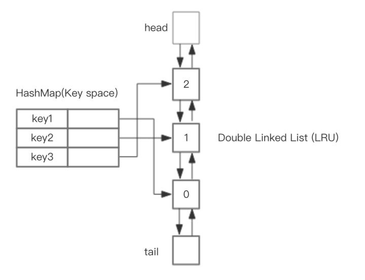

# 理解Redis数据缓存淘汰的实现

## 前言
Redis是一个内存kv存储，每个server的内存都是有限的，为了合理分配和利用内存，必须对内存中的数据设置过期时间和淘汰策略。

## 过期数据淘汰策略
Redis会将每个设置了过期时间的key放入到一个独立的字典中，并通过如下策略删除过期的key，
- 定时扫描删除：定时遍历字典查找过期的key并删除(集中处理)，对CPU不友好
- 惰性删除：通过客户端访问触发(零散处理)，对内存不友好

### 惰性删除
缺点是，如果key迟迟不被访问，就会占用很多内存空间。

#### 使用get
访问这个key时，对key的过期时间进行检查，如果过期了就立即删除。

#### 使用del删除
如果使用`del`删除数据，会直接释放对象的内存迟。但如果删除的key是一个非常大的对象，比如1kw元素的hash，那么删除操作就会导致单线程卡顿。

为了解决这个卡顿问题，在Redis4.0引入了`unlink`指令，对删除操作进行懒处理，丢给后台线程来异步回收内存。

#### 使用flushdb/flushall删除
如果使用`flushdb`和`flushall`指令清空数据库，也是极其缓慢的操作。Redis4.0也给这两个指令也带来了异步化，在指令后面增加`async` 参数即可让后台线程来异步回收内存。
> `flushall async`

### 定时扫描删除
Redis默认会每秒进行十次过期扫描，过期扫描不会遍历过期字典中所有的key，而是采用了一种简单的贪心策略。
1. 从过期字典中随机20个key；
1. 删除这20个key中已经过期的key；
1. 如果过期的key比率超过1/4且扫描时间低于25ms，重复步骤1；

> 为保证过期扫描不会出现循环过度，导致线程卡死现象，算法还增加了扫描时间的上限，默认不会超过25ms。

#### 经典案例
假如一个大型的Redis实例中所有的key在同一时间过期了，会出现怎样的结果？

Redis会持续扫描过期字典(循环多次)，直到过期字典中过期的key变得稀疏，才会停止(循环次数明显下降)。这就会导致线上读写请求出现明显的卡顿现象。导致这种卡顿的另外一种原因是内存管理器需要频繁回收内存页，这也会产生一定的CPU消耗。

当客户端请求到来时，服务器如果正好进入过期扫描状态，客户端的请求将会等待至少25ms后才会进行处理，如果客户端的超时时间低于25ms，那么就会出现大量的链接因为超时而关闭，业务端就会出现很多异常。
> 更惨的是Redis的slowlog中没有慢查询记录，因为慢查询指的是逻辑处理过程慢，不包含等待时间。

所以工程师一定要注意过期时间，如果有大批量的key过期，要给过期时间设置一个随机范围，而不宜全部在同一时间过期，分散过期处理的压力。

#### 从库的过期策略
从库不会进行过期扫描，对过期的处理是被动的。主库在key到期时，会在AOF文件里增加一条del指令，同步到所有的从库，从库通过执行这条del指令来删除过期的key。

> 因为指令同步是异步进行的，所以主库过期的key的del指令没有及时同步到从库的话，会出现主从数据的不一致，主库没有的数据在从库里还存在。

## 发生swap时的数据淘汰策略
当Redis内存超出物理内存限制时，内存的数据会开始和磁盘产生频繁的交换(swap)，会让Redis性能急剧下降。

为避免出现swap，Redis提供了配置参数maxmemory来限制内存超出期望大小。当实际内存超出maxmemory时，Redis提供了几种可选策略(maxmemory-policy)来让用户自己决定该如何腾出新的空间以继续提供读写服务。分别是：
1. noeviction：不会继续服务写请求(del请求可以继续服务)，读请求可以继续进行，这是默认的淘汰策略
1. volatile-lru：尝试淘汰设置了过期时间的key，最少使用的key优先被淘汰；未设置过期时间的key不会被淘汰，保证持久化的数据不会突然丢失
1. volatile-ttl：淘汰的key是剩余寿命ttl的值，ttl越小越优先被淘汰
1. volatile-random：淘汰的key是过期key集合中随机的key
1. allkeys-lru：淘汰的key是全体的key集合中最少使用的key优先被淘汰，而不只是过期key集合的，意味着未设置过期时间的key也会被淘汰
1. allkeys-random：淘汰的key是全体的key集合中随机的key

> volatile-xxx策略只会针对带过期时间的key进行淘汰，allkeys-xxx策略会对所有的key进行淘汰。

### Redis LRU的实现

#### 理想LRU的实现
基于HashMap和双向链表实现，整体的设计思路是，可以使用HashMap存储key，以实现save和get key的时间复杂度都是 O(1)，而HashMap的Value指向双向链表实现的LRU的Node节点。  

如下图所示，  

#### Redis LRU的实现
从上图中可以看出，如果按照HashMap和双向链表实现，需要额外的存储存放next和prev指针，牺牲比较大的存储空间，显然是不划算的。

所以，Redis LRU是一个近似算法，默认情况下，Redis随机挑选5个key，并且从中选取1个最近最久未使用的key进行淘汰。
> 在配置文件中通过maxmemory-samples的值来设置Redis需要检查key的个数。检查越多，耗时越久，淘汰的key越精确

根据Redis作者的说法，每个Redis Object可节省24bits的空间，但24 bits是不够存储两个指针的，而存储一个低位时间戳是足够的，Redis Object以秒为单位存储了对象新建或者更新时的unix time，也就是LRU clock，24 bits数据要溢出的话需要194天，而缓存的数据更新非常频繁，已经足够了。  

Redis3.0之后又改善了算法的性能，会提供一个待淘汰候选key的pool，里面默认有16个key，按照空闲时间排好序。更新时从Redis键空间随机选择N个key，分别计算它们的空闲时间idle，key只会在pool不满或者空闲时间大于pool里最小的时，才会进入pool，然后从pool中选择空闲时间最大的key淘汰掉。  

Redis4.0开始，新增LFU淘汰机制，提供更好缓存命中率。LFU(Least Frequently Used)通过记录键使用频率来定位最可能淘汰的键。

## 参考资料
1. [《redis学习》-- 缓存淘汰策略](https://blog.csdn.net/lizhi_java/article/details/68953179)
1. [Redis 数据淘汰机制](https://wiki.jikexueyuan.com/project/redis/data-elimination-mechanism.html)
1. [深入理解Redis数据淘汰策略](http://www.voidcn.com/article/p-rwzhvqnb-bah.html)
1. [深入剖析 redis 数据淘汰策略](http://www.voidcn.com/article/p-adxbhbxv-bmq.html)
2. [Redis 深度历险：核心原理与应用实践](https://juejin.im/book/5afc2e5f6fb9a07a9b362527)
3. [redis lru实现策略](http://blog.chinaunix.net/uid-20708886-id-5753422.html)
4. [Redis中的LRU淘汰策略分析](https://www.cnblogs.com/linxiyue/p/10945216.html)
5. [Redis中内存淘汰算法实现](http://fivezh.github.io/2019/01/10/Redis-LRU-algorithm/)
6. [redis之父的博客翻译-Redis中的LRU算法改进](https://blog.csdn.net/qq_35440678/article/details/53453107)