# Redis分布式高可用架构

## 前言
Redis在互联网中被大量使用，针对如何保证其分布式系统的高可用，整理了一些资料。

## 一致性哈希
一致性哈希算法在1997年由麻省理工学院提出的一种分布式哈希(DHT)实现算法，设计目标是为了解决因特网中的热点(Hot spot)问题。

### 性质
判定哈希算法好坏的四个定义：
1. 平衡性
2. 单调性
3. 分散性
4. 负载

在分布式集群中，对机器的添加删除，或者机器故障后自动脱离集群这些操作是分布式集群管理最基本的功能。如果采用常用的hash(object)%N算法，那么在有机器添加或者删除后，很多原有的数据就无法找到了，这样严重的违反了单调性原则。接下来主要讲解一下一致性哈希算法是如何设计的。

### 概念
简单来说，一致性哈希将整个哈希值空间组织成一个虚拟的圆环，如下图所示，  
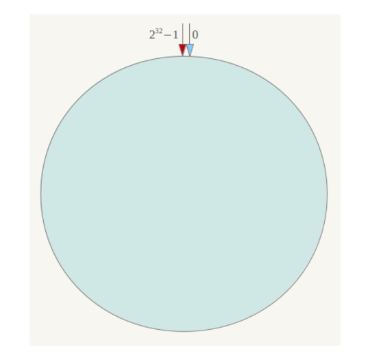  

下一步将各个服务器的ip或主机名作为关键字进行哈希，这样每台机器就能确定其在哈希环上的位置，这里假设将上文中四台服务器使用ip地址哈希后在环空间的位置如下：
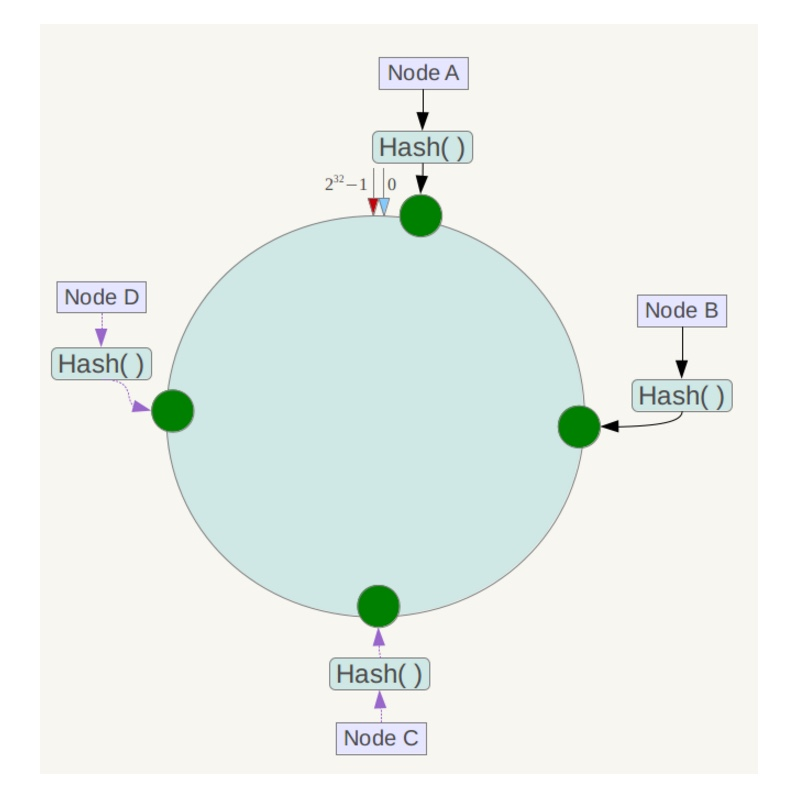  

接下来使用hash算法定位数据访问到相应服务器：将数据key使用相同的函数Hash计算出哈希值，并确定此数据在环上的位置，从此位置沿环顺时针“行走”，第一台遇到的服务器就是其应该定位到的服务器。  

例如我们有Object A、Object B、Object C、Object D四个数据对象，经过哈希计算后，在环空间上的位置如下：  
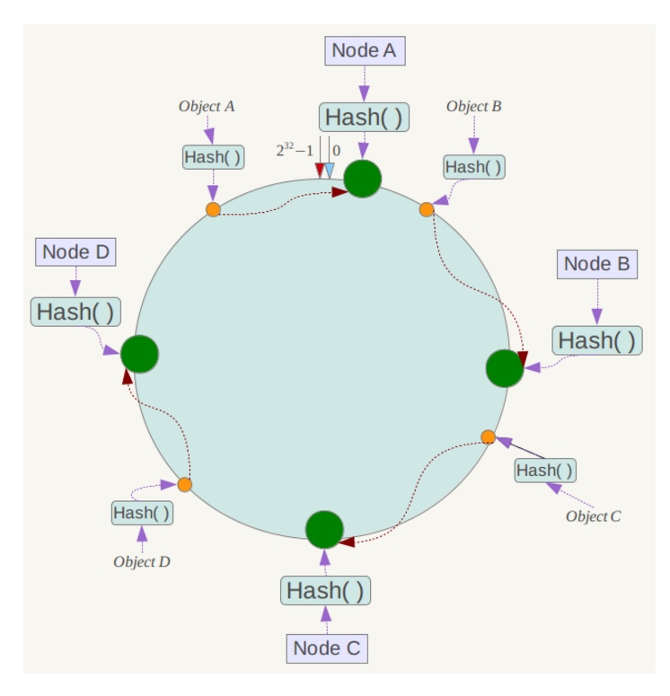

根据一致性哈希算法，数据A会被定为到Node A上，B被定为到Node B上，C被定为到Node C上，D被定为到Node D上。

### 容错性和扩展性
假设Node C不幸宕机，可以看到此时对象A、B、D不会受到影响，只有C对象被重定位到Node D。一般如果一台服务器不可用，则受影响的数据仅仅是此服务器到其环空间中前一台服务器(即沿着逆时针方向行走遇到的第一台服务器)之间数据，其它不会受到影响。

假设在系统中增加一台服务器Node X，如下图所示：  
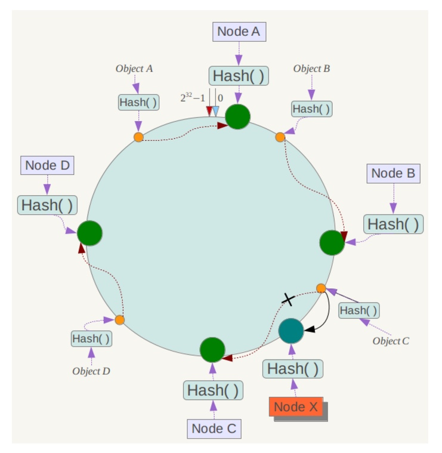

此时对象A、B、D不受影响，只有对象C需要重定位到新的Node X 。一般如果增加一台服务器，则受影响的数据仅仅是新服务器到其环空间中前一台服务器(即沿着逆时针方向行走遇到的第一台服务器)之间数据，其它数据也不会受到影响。

综上所述，一致性哈希算法对于节点的增减都只需重定位环空间中的一小部分数据，具有较好的容错性和可扩展性。

### 解决数据不均匀
一致性哈希算法在服务节点太少时，容易因为节点分部不均匀而造成数据倾斜问题。例如系统中只有两台服务器，其环分布如下，
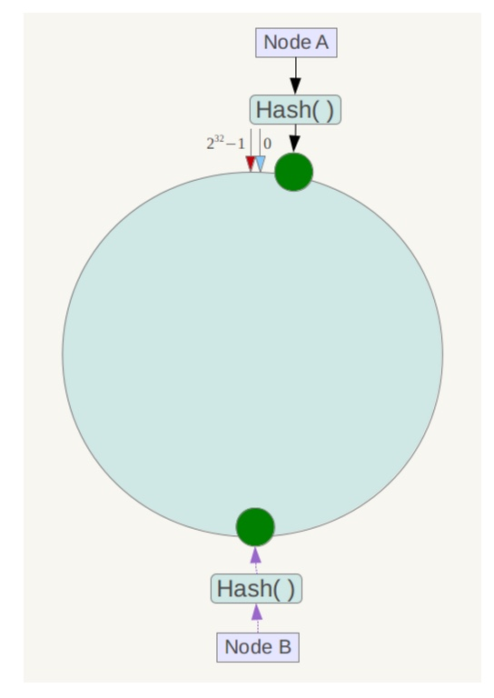

为了解决这种数据倾斜问题，一致性哈希算法引入了虚拟节点机制，即对每一个服务节点计算多个哈希，每个计算结果位置都放置一个此服务节点，称为虚拟节点。具体做法可以在服务器ip或主机名的后面增加编号来实现。例如上面的情况，可以为每台服务器计算三个虚拟节点，于是可以分别计算 “Node A#1”、“Node A#2”、“Node A#3”、“Node B#1”、“Node B#2”、“Node B#3”的哈希值，于是形成六个虚拟节点：  
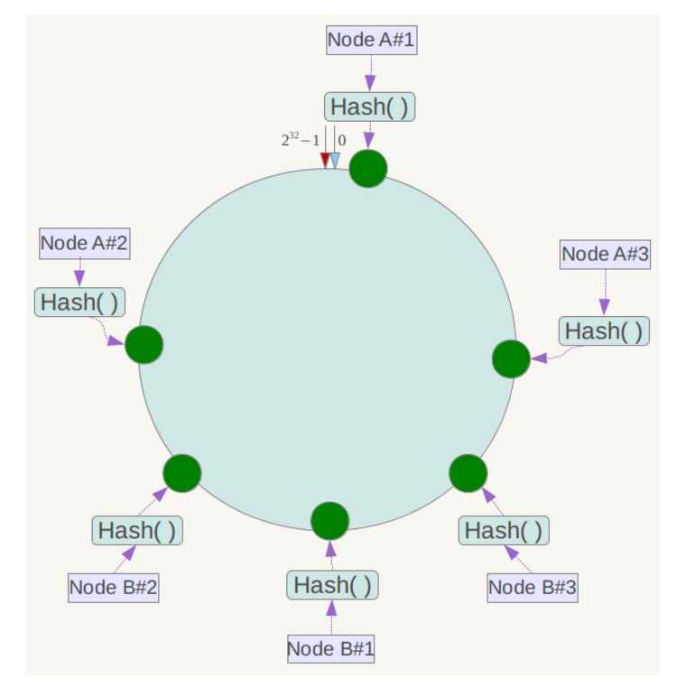

## Redis哈希槽
Redis集群中内置了16384个哈希槽，当需要在Redis集群中放置一个key-value时，Redis先对key使用crc16算法算出一个结果，然后把结果对16384求余数，这样每个key都会对应一个编号在0-16383之间的哈希槽，Redis会根据节点数量大致均等的将哈希槽映射到不同的节点。

### 举例
假设现在有3个节点已经组成了集群，分别是：A，B，C三个节点，它们可以是一台机器上的三个端口，也可以是三台不同的服务器。那么，采用哈希槽(hash slot)的方式来分配16384个slot 的话，它们三个节点分别承担的slot 区间是：
- 节点A覆盖0－5460
- 节点B覆盖5461－10922
- 节点C覆盖10923－16383

这种将哈希槽分布到不同节点的做法使得用户可以很容易地向集群中添加或者删除节点。 比如说：
- 如果用户将新节点D添加到集群中，那么集群只需要将节点A、B、C中的某些槽移动到节点D就可以了，大致就会变成这样：
    - 节点A覆盖1365-5460
    - 节点B覆盖6827-10922
    - 节点C覆盖12288-16383
    - 节点D覆盖0-1364,5461-6826,10923-12287

- 与此类似，如果用户要从集群中移除节点A，那么集群只需要将节点A中的所有哈希槽移动到节点B和C，然后再移除空白(不包含任何哈希槽)的节点A就可以了

### Redis为什么没使用一致性哈希
Redis的作者认为它的crc16(key) mod 16384的效果已经不错了，虽然没有一致性hash灵活，但实现很简单，节点增删时处理起来也很方便。
- 当需要增加节点时，只需要把其他节点的某些哈希槽挪到新节点就可以了；
- 当需要移除节点时，只需要把移除节点上的哈希槽挪到其他节点就行了；

### 为什么哈希槽的数量固定为16384
1. redis的一个节点的心跳信息中需要携带该节点的所有配置信息，而16K大小的槽数量所需要耗费的内存为2K，但如果使用65K个槽，这部分空间将达到8K，心跳信息就会很庞大
1. Redis集群中主节点的数量基本不可能超过1000个
1. Redis主节点的配置信息中，它所负责的哈希槽是通过一张bitmap的形式来保存的，在传输过程中，会对bitmap进行压缩，但是如果bitmap的填充率slots/N很高的话，bitmap的压缩率就很低，所以N表示节点数，如果节点数很少，而哈希槽数量很多的话，bitmap的压缩率就很低。而16K个槽当主节点为1000的时候，是刚好比较合理的，既保证了每个节点有足够的哈希槽，又可以很好的利用bitmap
2. 选取了16384是因为crc16会输出16bit的结果，可以看作是一个分布在0-2^16-1之间的数，redis的作者测试发现这个数对2^14求模的会将key在0-2^14-1之间分布得很均匀，因此选了这个值

## Codis
### Redis集群方案
Redis的集群解决方案有社区的，也有官方的，
- 社区的解决方案有Codis和Twemproxy
- 官方的解决方案是Redis Cluster

### Codis
Codis采用一层无状态的proxy层，将分布式逻辑写在proxy上，底层的存储引擎还是Redis本身。
> 1. Cluster的数据存储模块和分布式的逻辑模块是耦合在一起的，这个带来的好处是部署异常简单。但缺点是，你很难对业务进行无痛的升级，比较伤运维
> 1. 协议修改较大，对客户端不太友好，目前很多客户端已经成为事实标准，程序已经写好了，让业务方去更换Redisclient，是不太现实的，而且目前很难说有哪个Rediscluster客户端经过了大规模生产环境的验证

Codis分为四个部分，分别是，
- Codis Proxy (codis-proxy)
- Codis Dashboard (codis-config)
- Codis Redis (codis-server)
- ZooKeeper/Etcd

使用Codis的集群是如下图所示，  
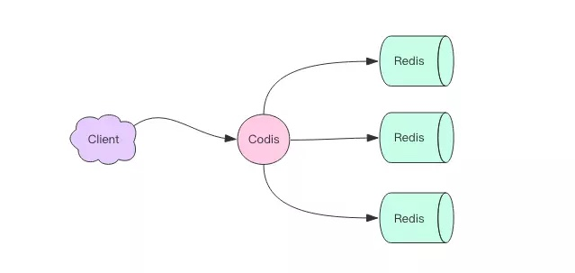

#### Codis分片原理
Codis会把所有的key分成1024个槽，这1024个槽对应着的就是Redis的集群，这个在Codis中是会在内存中维护着这1024个槽与Redis实例的映射关系。Codis中key的分配算法，先是把key进行CRC32后，得到一个32位的数字，然后再hash%1024后得到一个余数，这个值就是这个key对应着的槽，这槽后面对应着的就是Redis的实例。
> 槽个数可以配置，可以设置成 2048 或者是4096个。

> 【提问：为什么Codis很多命令行不支持，例如KEYS操作？】

#### Codis之间的槽位同步
Codis把这个工作交给了ZooKeeper来管理，如下图所示，  
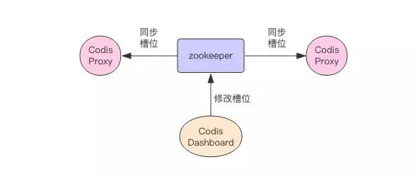

#### Codis中的扩容
因为Codis是一个代理中间件，所以这个当需要扩容Redis实例的时候，可以直接增加Redis节点。在槽位分配的时候，可以手动指定Codis Dashbord来为新增的节点来分配特定的槽位。  

在Codis中实现了自定义的扫描指令SLOTSSCAN，可以扫描指定的slot下的所有的key，将这些key迁移到新的Redis的节点中(话外语：这个是Codis定制化的其中一个好处)。  

首先，在迁移的时候，会在原来的Redis节点和新的Redis里都保存着迁移的槽位信息，在迁移的过程中，如果有key打进将要迁移或者正在迁移的旧槽位的时候，这个时候Codis的处理机制是，先是将这个key强制迁移到新的Redis节点中，然后再告诉Codis，下次如果有新的key的打在这个槽位中的话，那么转发到新的节点。

## 哨兵(sentinel)
负责持续监控主从节点的健康，当主节点挂掉时，自动选择一个最优的从节点切换为主节点。

客户端来连接集群时，会首先连接sentinel，通过sentinel来查询主节点的地址，然后再去连接主节点进行数据交互。当主节点发生故障时，客户端会重新向sentinel要地址，sentinel 会将最新的主节点地址告诉客户端。如此应用程序将无需重启即可自动完成节点切换。集群将可能自动调整为下图所示结构，
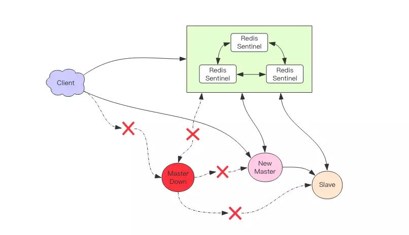

故障恢复，集群如下图所示，  
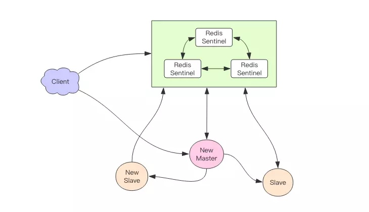

> 哨兵无法保证消息完全不丢失，但会尽可能保证消息少丢失

## 主从同步
### 全量同步
完整同步用于处理初次复制情况，其步骤如下：
1. Slave发送Psync给Master，由于是第一次发送，不带上runID和Offset
2. Master接收到请求，发送Master的runID和Offset给从节点
3. Master生成保存RDB文件
4. Master发送RDB文件给Slave
5. 在发送RDB的同时，写操作会复制到缓冲区Replication Backlog Buffer中，并从Buffer区发送到Slave
6. Slave将RDB文件的数据装载，并更新自身数据

如下图所示，  
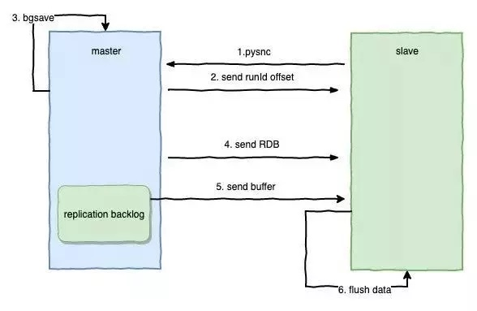

### 增量同步
全量同步将会消耗很多资源，为了解决这个问题，实现了增量同步，其步骤如下：
1. 网络发生错误，Master和Slave失去连接
1. Master依然向Buffer缓冲区写入数据
1. Slave重新连接上Master
1. Slave向Master发送自己目前的runID和Offset
1. Master会判断Slave发送给自己的Offset是否存在Buffer队列中
1. 如果存在，则发送Continue给Slave；如果不存在，意味着可能错误了太多的数据，缓冲区已经被清空，这个时候就需要重新进行全量的复制
1. Master发送从Offset偏移后的缓冲区数据给Slave
1. Slave获取数据更新自身数据

如下图所示，  
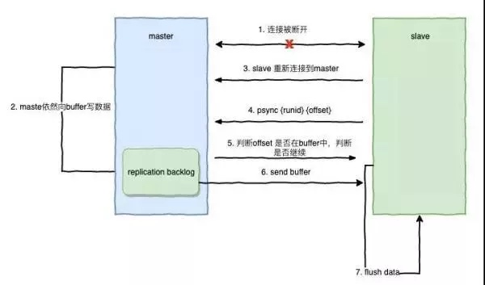

## 参考资料
1. [hash slot（虚拟桶）](https://www.cnblogs.com/abc-begin/p/8203613.html)
1. [Codis作者黄东旭细说分布式Redis架构设计和踩过的那些坑们](https://mp.weixin.qq.com/s?__biz=MzAwMDU1MTE1OQ==&mid=208733458&idx=1&sn=691bfde670fb2dd649685723f7358fea&scene=2&from=timeline&isappinstalled=0&key=744487672bdc02d166e3f67ac368f073cf0db249cdf3047ec2fc414da5d3f26a580d715c66a7f6bcbeacfaf04bacb10cdf046278fb0f52322ab7139f0d609eaaefa50e82e47242fc96f00b8aedc077ab&ascene=0&uin=Nzc3MzQ2MTgy&devicetype=iMac+MacBookPro11%2C1+OSX+OSX+10.10.3+build(14D136)&version=12020810&nettype=WIFI&lang=zh_CN&fontScale=100&pass_ticket=6AHO5gBAReB43RtRd6u0irzM75OfuXjdb5Xs9RdAMSwoieMLW7ic1%2Bjsd1djK0Ay)
6. [面试必备：什么是一致性Hash算法？](https://zhuanlan.zhihu.com/p/34985026)
7. [五分钟看懂一致性哈希算法](https://juejin.im/post/5ae1476ef265da0b8d419ef2)
8. [为什么大厂都喜欢用 Codis 来管理分布式集群？](https://juejin.im/post/5c132b076fb9a04a08218eef)
1. [大规模 codis 集群的治理与实践](https://cloud.tencent.com/developer/article/1006262)
2. [集群 1：李代桃僵 —— Sentinel](https://juejin.im/book/5afc2e5f6fb9a07a9b362527/section/5afc366751882567105ff0f3)
1. [Redis 哨兵机制](http://wiki.jikexueyuan.com/project/redis/guard-mechanism.html)