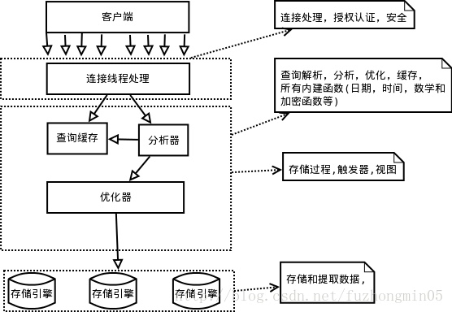
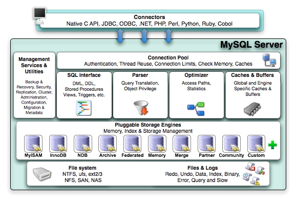
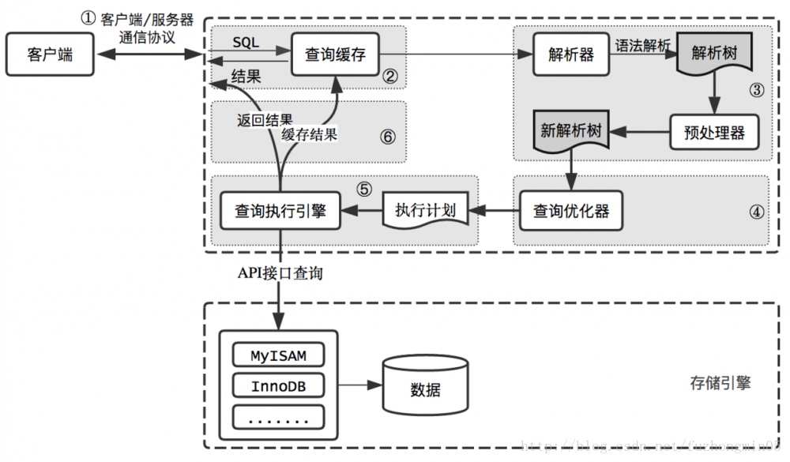

# MySQL 整体架构

## 整体逻辑架构

(图1. 整体逻辑示意图)  

(图2. 细化后整体逻辑示意图)  

(图3. SQL查询过示意图)  

## 模块说明
### 关于Client和Server的通信
C/S通信协议是“半双工”，即任一时刻，要么是S->C发送数据，要么是C->S发送数据。一旦C开始发消息，S必须接收完整个消息才能响应，反之也是，所以我们无法也无须将一个消息切成小块独立发送，也无法进行流量控制。

当C用一个单独的数据包(查询语句可能很长)将查询请求发给S，如数据包太大，S会拒绝接收并抛出异常。

相反的是，当S响应C请求时，数据可能被拆成多个数据包，且C必须完整接收整个返回结果，而不能简单的只取前面几条结果，然后让服务器停止发送。
> 开发时，尽量保持查询简单且只返回必需的数据，减小通信间数据包的大小和数量是一个非常好的习惯，这也是查询中尽量避免使用SELECT *以及加上LIMIT限制的原因之一。
  

### 关于查询缓存
MySQL将缓存存放在一个引用表，通过一个哈希值索引，这个哈希值通过查询本身、当前要查询的数据库、客户端协议版本号等一些可能影响结果的信息计算得来。如果当前查询恰好命中查询缓存，在检查一次用户权限后直接返回缓存中的结果。则可提升查询性能(见图3)。
> 如查询中包含任何用户自定义函数、存储函数、用户变量、临时表、mysql库中的系统表，其查询结果都不会被缓存。比如函数NOW()

但维护查询缓存也是有代价的，
1. 任何SQL在执行之前都要检测是否命中缓存(即使这条SQL永远不会命中)
2. 如查询结果可以被缓存，那么执行后将结果存入缓存，也会带来额外的系统消耗 
3. 在写操作(包括加字段)时，必须将对应表的所有缓存都设置为失效

基于此，应该谨慎使用查询缓存(已考虑在高版本不再支持)。

### 关于分析器
通过关键字对SQL进行解析，即词法分析和语法分析，并生成一颗解析树。
> 比如SQL中是否使用了错误的关键字，关键字的顺序是否正确，查询的数据表和数据列是否存在等，都在这里抛出异常。

### 关于优化器
经过分析器生成的语法树被认为是合法的，优化器将其转化成查询计划。多数情况下，一条SQL可以有很多种执行方式，最后都返回相应的结果。优化器的作用就是找到这其中最好的执行计划。

优化器使用了非常多的优化策略来生成一个最优的执行计划：
1. 重新定义表的关联顺序(多张表关联查询时，并不一定按照SQL中指定的顺序进行)
2. 优化MIN()和MAX()函数(找某列的最小值，如该列有索引，只需查找B+Tree索引最左端，反之则可以找到最大值)
3. 提前终止查询(如使用Limit时，查找到满足数量的结果集后会立即终止查询)
4. 优化排序(一次读取所有的数据行，然后根据给定的列排序。对于I/O密集型应用，效率会高很多)
> MySQL认为的最优跟我们想的最优并不一样(我们希望执行时间尽可能短，但MySQL选择它认为成本小的，但成本小并不意味着执行时间短)。

### 关于执行查询引擎
在解析和优化阶段以后，MySQL生成了执行计划，查询执行引擎会根据执行计划给出的指令逐步执行得出结果。整个执行过程的大部分操作均是通过调用存储引擎实现的接口(handler API)来完成。
> MySQL在查询优化阶段就为每一张表创建了一个handler实例，优化器可以根据这些实例的接口来获取表的相关信息，包括表的所有列名、索引统计信息等。

## 参考资料
1. 图1、图3 引自 [MySQL逻辑架构及性能优化原理](https://blog.csdn.net/fuzhongmin05/article/details/70904190)
2. 图2 引自 [1.MySQL整体逻辑架构](https://blog.csdn.net/ajian005/article/details/17427981)
3. [MySQL Internals Manual](https://dev.mysql.com/doc/internals/en/)